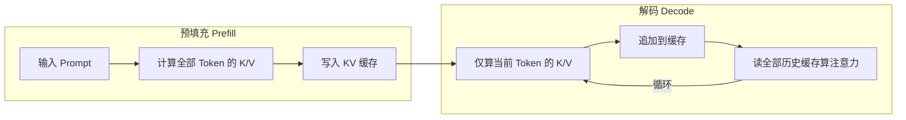

# KV Cache

## 核心结论

自回归生成过程中，每产生一个新 token 都要与全部历史 token 执行注意力运算；为避免对历史 Key/Value 的重复计算，系统将历史 token 的 Key 与 Value 缓存起来，此即 KV Cache。它是**流式 decode 的标配**，但显存占用随序列长度**线性增长**，构成 [[显存墙]] 的直接成因——也因此催生了 [[KV Cache优化技术栈总览|五级优化技术栈]]。

## 两阶段工作机制

- **Prefill**：接收完整 Prompt，一次性算完全部输入 Token 的 K/V 写入缓存，**计算密集**、算力为瓶颈；
- **Decode**：每生成一个新 Token 只算它的 K/V 追加到缓存末尾，同时读取全部历史缓存完成注意力，**访存密集**、显存带宽为瓶颈。

每层各缓存一份 K 与 V，解码第 t 步只需把新 token 的 Q 与缓存中的全部 K/V 做注意力，历史 K/V 不再重算。

## 显存占用

$$\text{KV 大小} = 2 \times L \times H_{\text{kv}} \times d_k \times S \times B \times p$$

系数 2 对应 Key 与 Value 两个独立张量，$L$ 层数、$H_{\text{kv}}$ KV 头数、$d_k$ 单头维度、$S$ 上下文长度、$B$ 批大小、$p$ 单元素字节数（FP16 为 2、INT8 为 1、INT4 为 0.5）。

四个线性因子（$S/B/L/H_{\text{kv}}$）**任一扩张都线性推高显存**。以 LLaMA-2 70B（80 层、隐藏维度 8192、FP16）为例：32k 上下文约 80GB，128k 约 320GB，已超出单卡 HBM 容量。权重量化到 INT4 后权重缩为 1/4，而 KV 仍高精度，会出现**KV 缓存反超模型权重**的现象。

## 优化技术栈

解码本质是**内存带宽绑定**：计算量仅 $O(T)$，却每步都要读完整个缓存，由此形成「重算慢、缓存占显存」的两难。解法分五级、彼此正交、可按需叠加，详见 [[KV Cache优化技术栈总览]]：

| 层 | 代表技术 | 治什么症 |
|---|---|---|
| 模型架构层 | [[GQA与MQA多头变体]]、[[MLA低秩潜在注意力]] | 存得太多 |
| 算子计算层 | [[FlashAttention算子优化]] | 算得慢、读得累 |
| 数据表示层 | [[KVCache低比特量化]] | 存得太胖 |
| 系统管理层 | [[PagedAttention分页内存]] | 放得乱 |
| 应用调度层 | [[KV Cache分级存储]]、稀疏淘汰 | 放不下 |

## 与相邻缓存机制区分

| 机制 | 复用范围 | 主要收益 |
|------|----------|----------|
| KV Cache | **单请求内** | 省去历史 K/V 重算，支撑流式解码 |
| 前缀缓存 | **跨请求** | 复用相同前缀的 KV，降低 prefill 开销 |
| PagedAttention | 单请求内 | 分页管理消除显存碎片，提升利用率 |

三者正交：前缀缓存与 PagedAttention 均不扩展显存总容量，只有 [[KV Cache分级存储]] 直接扩容。

## 相关页面

- [[大模型推理全链路]]：KV Cache 在推理流水线中的位置
- [[KV Cache显存估算]]：显存公式与实例计算
- [[显存墙]]：KV Cache 线性增长撞上的容量上限
- [[KV Cache分级存储]]：把 KV 摊到多级存储的解法
- [[前缀缓存与PagedAttention]]：相邻机制的能力边界
- [[Prefill与Decode两阶段]]：资源不对称性与 PD 分离部署
- [[TTFT首字延迟优化]]：KV Cache 在延迟优化主线中的位置
- [[自注意力机制]]：KV Cache 所加速的注意力计算

## 参考来源

- [[raw/papers/KV Cache.md]]
- [[raw/papers/KV Cache分级存储.md]]
