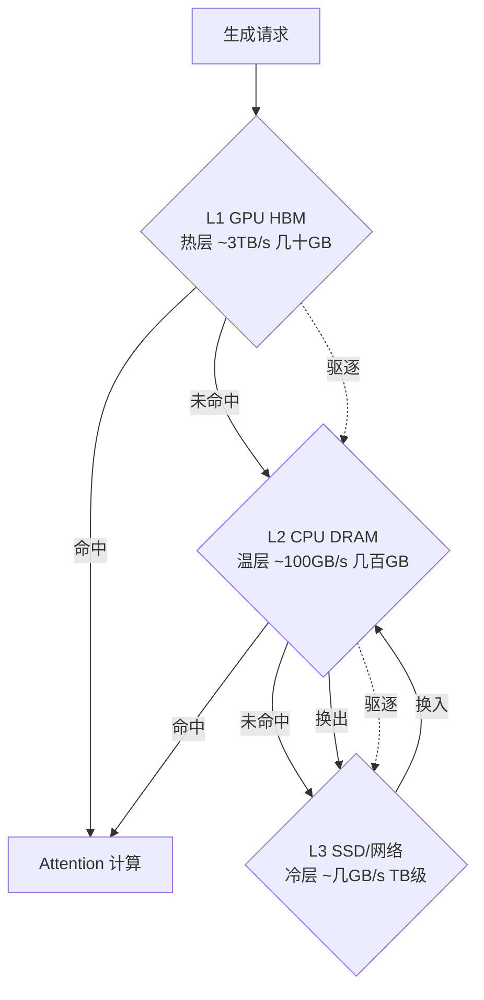

# KV Cache分级存储

## 核心结论

分级存储以带宽代价换取有效显存容量数倍至数十倍的扩展。其可行性建立在一条经验规律上：注意力访问具有**时间局部性**，大部分 token 在大部分时间内并不被访问；因此可以把冷 KV 下沉到更慢但更大的介质，只让热 KV 占据 HBM。

## 三级架构与数据流



| 层级 | 介质 | 带宽 | 容量 | 存储内容 |
|------|------|------|------|----------|
| L1 热层 | GPU HBM | ~3 TB/s | 数十 GB | 最近或最常被注意的 token |
| L2 温层 | CPU DRAM | ~100 GB/s | 数百 GB | 较久未访问、可能被回看的 token |
| L3 冷层 | SSD/网络 | ~数 GB/s | TB 级 | 长期未被访问的 token |

## 机制协同示例

```python
def generate_with_tiered_cache(request):
    for step in range(max_steps):
        # 预取：预测下一步需要的 KV，提前从 DRAM 搬回 HBM
        prefetch_kv(predicted_tokens)
        # 前向计算：HBM 命中则直接算，未命中则换入
        output = attention(query, hbm_cache)
        # 驱逐：HBM 满了，按策略选冷 token 下沉到 DRAM/SSD
        if hbm_cache.is_full():
            victims = select_victims(eviction_policy)
            swap_out(victims, target_tier="DRAM")
        # 换入：计算中发现需要的 token 在 DRAM/SSD，搬回 HBM
        if needed_kv not in hbm_cache:
            swap_in(needed_kv, source_tier="DRAM")
```

**迁移由推理框架自动执行，开发者无需手动分级**，仅需配置层级容量配比与驱逐阈值等参数。

## 权衡

| 收益 | 代价 |
|------|------|
| 有效容量扩展数倍至数十倍 | 换入/换出消耗带宽 |
| 长上下文可运行 | 冷数据访问延迟上升 |
| 高并发可承载 | SSD 带宽仅数 GB/s，需控换出频率 |

## 相关页面

- [[显存墙]]：分级存储要解决的核心瓶颈
- [[三级存储金字塔]]：层级参数与容量/带宽对照
- [[驱逐策略]]：决定谁下沉
- [[换入换出与数据迁移]]：决定怎么搬
- [[预取机制]]：决定何时提前搬
- [[压缩机制与体积缩减]]：与分级正交的另一条路径
- [[代表项目对比]]：vLLM/FlexGen/InfiniGen/Mooncake 方案差异
- [[KV Cache]]：被分级的对象

## 参考来源

- [[raw/papers/KV Cache分级存储.md]]