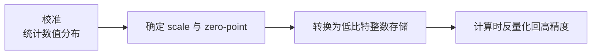

# KVCache低比特量化

## 量化流程

## 核心结论

在**不修改模型结构**的前提下降低 KV 数值的存储精度，可直接线性减少显存占用，是部署侧的首选优化手段。量化的基础流程为：校准统计数值分布 → 确定缩放因子 scale 与零点 zero-point → 转换为低比特整数存储 → 计算时反量化回高精度。

量化粒度由粗到细包括 per-tensor、per-token、per-channel：**粒度越细精度越高**，但计算与存储开销也相应增加。

## 非对称量化发现（KIVI）

传统量化对 K 与 V 采用统一粒度，但 KIVI（ICML 2024）通过统计分析发现两个关键观察：

1. **Key 张量**：各通道方差差异大，存在少数高幅值离群通道，按**通道（per-channel）**量化可更好保留精度；
2. **Value 张量**：各通道分布平坦，且需要支持流式追加写入，按 **Token（per-token）**量化更高效且精度损失可忽略。

据此提出的 KIVI 算法采用 **K per-channel + V per-token 的非对称 2bit 量化**，无需训练微调，硬件友好。

**实测性能**：

- 峰值显存减少 **2.6 倍**，最大批大小扩大 **4 倍**；
- 端到端吞吐量提升 **2.35–3.47 倍**，生成质量基本无损。

## 精度补偿

为补偿量化精度损失，通常保留最近 $R$ 个 Token 的 FP16 缓存（**滑动窗口**），仅对历史 Token 做低比特量化，在显存与精度间取得平衡。后续进阶方案包括 Kitty（保留 sink 区域 FP16）、KVQuant、Duo-Attention 等，进一步在极低比特下保障推理质量。

> **注意**：KV 缓存量化与模型权重量化是**两个独立的优化方向**，二者可叠加使用——权重 INT4 而 KV 仍高精度时，KV 会反超权重成为第一显存开销。

## 相关页面

- [[KV Cache]]：量化所作用的缓存本体与显存公式
- [[GQA与MQA多头变体]]：与之正交的架构层减基数方案
- [[KV Cache优化技术栈总览]]：数据表示层在五级栈中的位置
- [[KVCache场景选型指南]]：INT8 → INT4 在落地优先级中的排位

## 参考来源

- [[raw/papers/KV Cache.md]]
