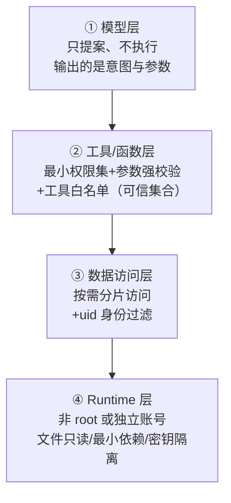

# LLM权限最小化

## 核心结论

- 安全悖论：**权限给的越多，越危险**。LLM 权限最小化原则与开发者义务（最小权限）强制执行相反——常规系统优先保障功能可达，LLM 场景反而要用"小权限"收敛注入爆炸半径[[1]](#ref-1)。
- 四层抽象：模型层（只提案）→ 工具/函数层（最小权限）→ 数据访问层（按需分片）→ 运行时环境层（非root/只读/密钥隔离）[[1]](#ref-1)。
- 核心范式与[[LLM-Agent安全防护总览]]一致：即使模型被说服，权限最小化确保其"权力受限"。

## 四层落地模型

<b>图1 权限最小化四层</b>

## 各层要点

| 层 | 职责 | 关键动作 |
|---|---|---|
| ① 模型层 | 模型只做决策提案，不直接触碰资源 | 输出结构化意图+参数；动作执行下沉工具层 |
| ② 工具/函数层 | 工具接口承接真实动作 | 按需最小权限集声明；Pydantic 强校验入参；工具白名单；[[工具调用零信任管控]] |
| ③ 数据访问层 | 控制数据读粒度 | 按需分片（如仅读当前 Query 涉及的文档）；uid/身份过滤（防 Cross-user）；最小范围查询 |
| ④ Runtime 层 | 环境与密钥管控 | 进程非 root/独立账号；文件只读；最小依赖；密钥隔离（Key 不落上下文、秘钥托管） |

## 落地要点

- **工具声明权限集**：对每个工具显式声明最小权限，避免一个工具带大量隐含能力。
- **白名单优先**：工具集合走显式白名单（可信集合），未声明工具一律不可用——与[[工具调用零信任管控]]的 Fail Closed 呼应。
- **数据分片**：照片/文档/数据库等资源按身份过滤后给模型，避免"全库读权限"被注入间接利用。
- **Runtime 隔离**：Agent 运行上下文最小化，即使注入命令也无法扩大伤害。
- 兜底数字：OWASP 建议高风险动作进入**人类在环（human-in-the-loop）审批**[[1]](#ref-1)。

## 相关页面

- [[LLM-Agent安全防护总览]]：权限最小化位置
- [[工具调用零信任管控]]：工具层执行管控
- [[输出验证与人工审批]]：高风险动作人类确认

## 参考来源

- [[raw/papers/LLM-Agent安全防护-提示词注入防御与权限最小化综合研究.md]]
- [[raw/articles/doubao-LLM权限最小化落地.md]]

---

[1] 豆包 LLM 应用权限最小化素材，见 [[raw/articles/doubao-LLM权限最小化落地.md]]