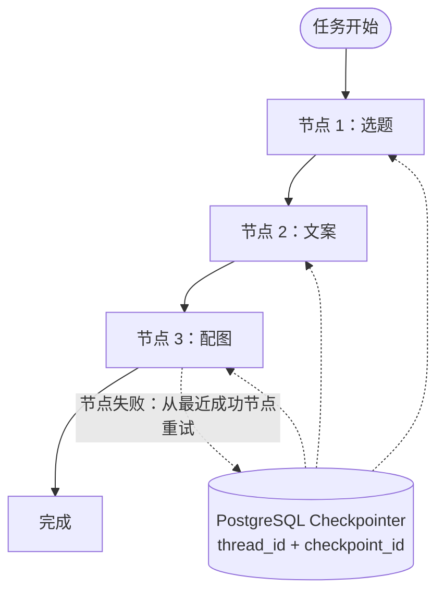

# LangGraph与Checkpointer工作流

## 故障自愈机制

## 核心结论
- 内容生成长流程（选题→文案→配图）用 LangGraph **子图拆分 + Checkpointer**，把故障范围从「整任务失败」缩小到「**单个节点**」——失败时从最近成功节点重试，保留已生成内容、省 Token。
- **Checkpointer 用 PostgreSQL** 存节点级 state（`thread_id + checkpoint_id`），与业务库统一，支持任意历史节点恢复。
- 配套能力：`astream_events` 与前端 SSE 逐 Token 联动、`asyncio.gather` 配图并发 + 指数退避、多模型路由 + `structured_output` 降本、MetricsContext/LangSmith/structlog 可观测。

## 要点拆解

### 为什么选 LangGraph 而非简单 Chain / Celery
- 简单 Chain：一个节点失败整单重来，浪费 Token、用户体验差。
- Celery 偏任务调度；LangGraph **自带状态机**，任务逻辑**节点化**更适合分支/子图。

### 节点级重试 vs 整任务重试
| | 整任务 | 节点级 |
|--|--------|--------|
| Token 成本 | 高 | 低 |
| 用户体验 | 全部重来 | 保留已生成文案 |
| 实现 | 简单 | LangGraph + Checkpointer |

### Checkpointer 与 LiveClip PG 任务队列的区别
| | LiveClip PG 队列 | MultiVis Checkpointer |
|--|------------------|----------------------|
| 粒度 | 整任务 pending/running/done | Graph 节点级 state |
| 失败恢复 | 整任务 reset pending | 从失败节点重试 |
| 适用 | 线性流水线 ASR→LLM | 分支/子图 LangGraph |

### 流式 + Checkpoint 共存
- 流式只影响**展示**（SSE 逐 token 渲染前端 ReadableStream）；checkpoint 在**节点边界**提交，统一 thread state，不冲突。
- SubGraph 间通过**共享 state** 传递选题→文案→配图结果。

### 配套优化
- 多模型路由：短标题/简单种草 → Flash 轻量；长图文深度测评 → 旗舰；`with_structured_output` + Pydantic 约束 JSON 减少解析失败重试。
- 配图并发：`asyncio.gather` + `run_in_executor`，1s→2s→4s 指数退避抗抖动，耗时 ↓70%。
- 高可用：SlowAPI 限流、K8s 健康检查 + 优雅关闭（停接新单、排空进行中）、绘图/LLM 连续失败熔断降级文案-only。

## 相关页面
- [[MultiVis-AI]]：本技术的落地项目
- [[LiveClip-AI]]：另一种长任务方案（整任务 PG 队列）
- [[商城AI业务矩阵]]：多 Agent 应用层整体编排

## 参考来源
- [[贸易AI业务]]