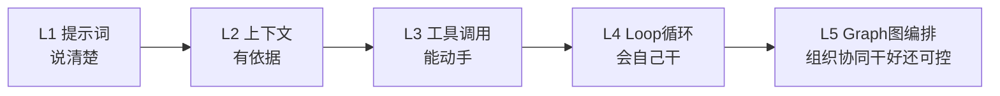
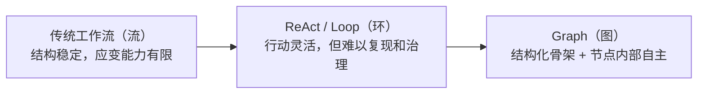

# Loop与Graph控制流演进

## 五层演进图

## 核心结论

- Graph **不是凭空出现**，而是建立在前四层能力之上，缺少任意一层都无法真正落地。
- 五层各解决一个问题：Prompt 解决"说清楚"，Context 解决"有依据"，Tool 解决"能动手"，Loop 解决"会自己干"，Graph 解决"能组织多单元协同干好、还可控"。
- 演进是**叠加不是替代**：上 Graph 之后，下层的提示词、上下文、工具与 Loop 依然在节点内部发挥作用。

## 要点拆解

### 五层能力对照

| 层级 | 模式 | 核心能力 |
|------|------|----------|
| L1 | 提示词 | 描述目标、任务和输出要求，人写死步骤，模型只负责填空 |
| L2 | 上下文 | 加入资料、历史信息和约束，让模型基于已知信息执行 |
| L3 | 工具调用 | 读取外部数据、操作外部环境，突破模型自身能力边界 |
| L4 | Loop 循环 | 把驾驶权交给模型，自主尝试、检查、修正，目标未达成则持续运行 |
| L5 | Graph 图编排 | 多个专职节点协作与治理，解决系统级的调度、观测与恢复问题 |

### 架构融合：Graph 不是回到死板的传统工作流

常见误解是把 Graph 等同于"倒退回写死步骤的传统工作流"。正确的演进链路是三者各取所长：

- **传统工作流**：结构稳定，但应变能力有限
- **ReAct / Loop**：行动灵活，但难以复现和治理
- **Graph**：结构化骨架 + 节点内部自主

> 核心：用可治理的系统骨架，承载模型的灵活判断。

## 相关页面

- [[Agent循环]]：L4 层的机制本体，Graph 节点内部仍是 Loop
- [[Graph图编排架构]]：L5 层的四要素与三拓扑
- [[单体Loop结构性瓶颈]]：从 L4 升级到 L5 的根本动因
- [[Loop与Graph选型对比]]：什么时候停在 L4、什么时候上 L5
- [[Agentic Harness]]：承载 Loop 的运行时外壳

## 参考来源

- [[raw/articles/Loop之后为什么是Graph.md]]
