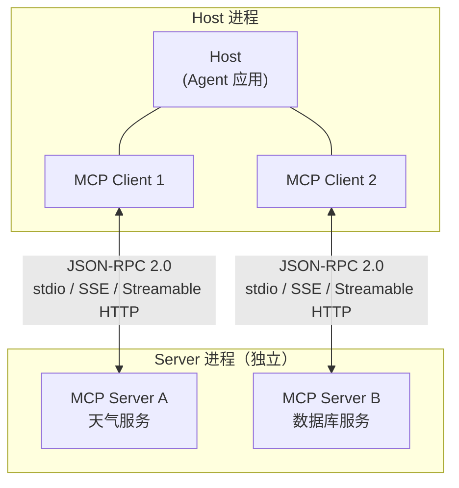

# MCP协议架构

## Client-Host-Server 三层架构

<b>MCP Client-Host-Server 三层架构</b>

## 核心结论
- MCP 是 Anthropic 2024 年底发布的开放协议，解决 Function Tool 的**跨框架复用**问题：一次编写，LangGraph/Claude Code/Cursor 等所有支持 MCP 的 Agent 都直接可用 [[raw/papers/Function-Calling与MCP-Tool设计.md]]。
- 三层架构：**Host**（运行 LLM 的 Agent 应用）/ **Client**（Host 内为每个 Server 维护的协议实例）/ **Server**（独立进程暴露 Tool 能力）。

## 要点拆解
- **能力协商**：Client/Server 连接建立时交换各自支持的能力声明，确保协议兼容。
- **工具发现**：`tools/list` 方法返回所有已注册工具的名称、描述、参数 Schema——Agent 无需硬编码，实现运行时动态发现。
- **执行**：`tools/call` 封装 tool_call 为 JSON-RPC 请求发送给对应 Server。
- **传输层演进**：stdio（本地进程）→ SSE → Streamable HTTP（远程部署 + 流式传输），满足企业级生产需求。
- **与网关**：MCP 服务端可解析 JSON-RPC、路由模块统一编排 RAG/Tool/Memory 等能力模块，是[[MCP网关]]的协议基础。

## 相关页面
- [[Function Tool与MCP Tool对比]]：与原生 Function Tool 的差异
- [[MCP网关]]：MCP 协议在 AI 业务网关的落地形态
- [[ToolRegistry跨框架互操作]]：跨 Provider 的能力抽象
- [[Skill工程化总览]]：Skill 依赖 MCP Tool 的协作模型

## 参考来源
- [[raw/papers/Function-Calling与MCP-Tool设计.md]]
- [[MCP网关]]：MCP 协议在 AI 业务网关的同主题工程落地面