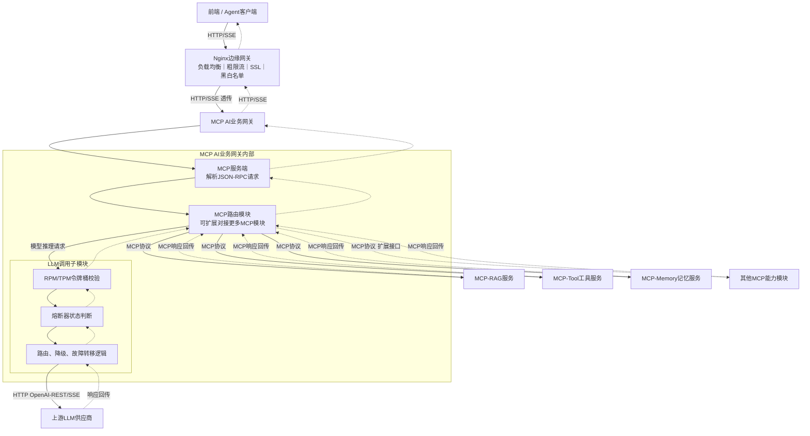

# MCP网关

## MCP 网关总体架构

## 核心结论
- MCP 网关是 [[双层网关架构]] 中 AI 业务网关的**一种落地形态**：外部仍走「Client → Nginx → MCP AI网关 → 上游 LLM」，内部拆分为协议层、路由层、LLM 调用子模块三层。
- **协议层**：MCP 服务端解析 JSON-RPC 请求，是 MCP（Model Context Protocol）标准入口。
- **路由层**：MCP 路由模块统一编排能力模块——MCP-RAG 检索、MCP-Tool 工具、MCP-Memory 记忆，以及可扩展的其他 MCP 能力；上游 LLM 供应商不在 MCP 协议内，需经 LLM 调用子模块做协议转换。
- **LLM 调用子模块**：内置完整流量调度链——[[RPM与TPM联合令牌桶]] 校验 → [[熔断器状态机]] → 路由/降级/故障转移逻辑，再转发上游（HTTP OpenAI-REST 协议）。
- 响应回传路径与请求对称：各 MCP 模块响应 → MCPRouter → MCPServer → MCPGateway → Nginx → Client，全程 HTTP/SSE。

## 要点拆解

### 为什么 Gateway 内要拆三层
MCP 是客户端与能力提供方之间的**协议标准**（JSON-RPC 请求/响应），而 LLM 调用是数据面语义。三层分离让协议接入（MCPServer）、能力编排（MCPRouter）、流量治理（LLMProxy）各自演进：新增一个 MCP 能力模块只需在路由层挂一个子节点，不动协议与调度逻辑。

### 能力模块与流量调度的解耦
MCP-RAG/Tool/Memory 是**业务能力**，走 MCP 协议路由；只有**模型推理请求**才下沉到 LLMProxy 经受令牌桶-熔断-路由。这样流量治理只作用于 LLM 调用这一条荷重链路，避免对纯本地能力（RAG/Tool/Memory）做无谓限流。

### 与上游的协议转换
Upstream 是 OpenAI-REST/SSE 语义，非 MCP 协议——LLMProxy 承担两种协议的边界转换，这也是把「网关」与「MCP 能力代理」区分开的关键设计。

## 相关页面
- [[双层网关架构]]：MCP 网关是其 AI 业务网关层的落地形态
- [[LLM网关动态路由与流量治理总览]]：网关体系总览
- [[RPM与TPM联合令牌桶]] / [[熔断器状态机]]：LLM 调用子模块内嵌的调度原语
- [[能力标签驱动降级]] / [[灰度回切]]：路由/降级/故障转移逻辑实现
- [[SSE流式容错]]：Upstream 至 Client 的流式通道
- [[MCP协议架构]]：MCP Client-Host-Server 协议层原理（本网关的协议基础）
- [[Function Tool与MCP Tool对比]]：MCP-Tool 服务与原生 Function Tool 的差异
- [[工具调用零信任管控]]：MCP-Tool 工具链路的安全管控
- [[LLM权限最小化]]：工具/数据/运行时权限收敛

## 参考来源
- [[raw/papers/面向大模型服务的动态路由与流量治理架构研究.md]]