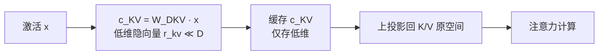

# MLA低秩潜在注意力

## 压缩与还原流程

## 核心结论

MLA（Multi-head Latent Attention）由 DeepSeek 团队提出，改变的是**缓存什么东西**：不再保存完整的 K/V 向量，而是缓存一个**低维隐向量**，计算时再投影回原空间。

$$c_{\text{KV}} = W_{\text{DKV}} \cdot x, \quad r_{\text{kv}} \ll D$$

其中 $c_{\text{KV}}$ 为缓存的隐向量，维度 $r_{\text{kv}}$ 远小于原始 KV 维度 $D$——缓存量因此直接按压缩比下降，而不必改动序列管理方式。

**实测性能**（DeepSeek-V2）：

- KV 缓存减少 **93.3%**；
- 最大生成吞吐量提升至 **5.76 倍**；
- 训练成本同时降低 **42.5%**。

它是目前架构层面压缩效率最高的方案，与 [[GQA与MQA多头变体]] 的「减头数」路线不同，走的是「存隐向量」路线。

## 适用范围的边界

值得特别注意：对采用 MLA 与 [[MoE混合专家模型总览|MoE]] 的模型，KV 缓存与激活显存被大幅压缩后，**推理瓶颈会从访存带宽转向互连带宽与专家负载均衡**，注意力专用加速硬件的必要性随之下降。

其中「互连带宽」对应 [[MoE通信开销与优化路线|专家并行的 All-to-All 通信]]，「专家负载均衡」对应 [[MoE推理部署与冗余专家|推理期的冗余专家调度]]——这两个问题都是稠密模型所没有的。

这一结论限定了「解码阶段访存绑定」这一经典论断的适用范围——该论断主要面向 **MHA/GQA 类模型**，套用到 MLA+MoE 模型上会误判瓶颈所在。

## 相关页面

- [[GQA与MQA多头变体]]：同属模型架构层的减头数路线
- [[多头注意力]]：MLA 所改造的原始注意力形态
- [[KV Cache]]：缓存对象与显存基数
- [[KV Cache优化技术栈总览]]：模型架构层在五级栈中的位置
- [[主流推理框架KV技术对比]]：面向 MLA 的算子适配（FlashMLA）
- [[MoE混合专家模型总览]]：与 MLA 并列的另一项 DeepSeek 架构创新
- [[MoE通信开销与优化路线]]：MLA 压缩显存后新凸显的通信瓶颈

## 参考来源

- [[raw/papers/KV Cache.md]]
