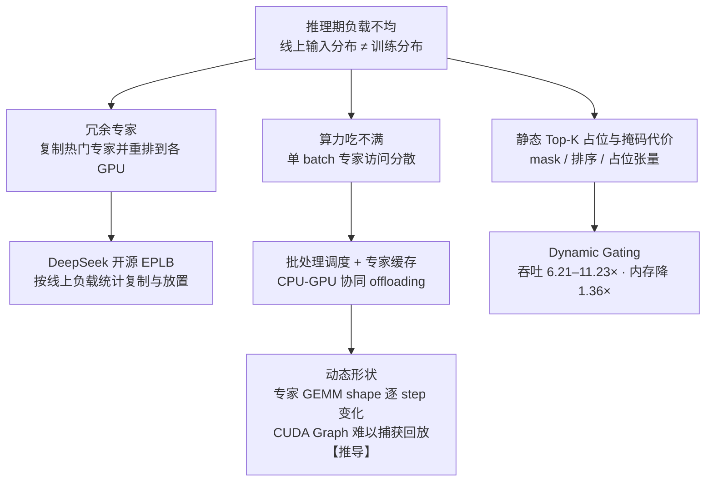

# MoE推理部署与冗余专家

## 推理期的三类开销

## 核心结论

**训练期的均衡手段无法保证推理期同样均衡**——线上输入分布与训练分布存在偏差。主流方案是**冗余专家**：根据线上负载统计复制热门专家，并启发式重排到各 GPU，DeepSeek 开源的 **EPLB**（Expert Parallelism Load Balancer）即为此类实现。

MoE 推理还有两个结构性约束：

- **需大 batch 才能吃满算力**：单 batch 时专家访问分散，批处理调度、专家缓存与 CPU-GPU 协同 offloading 是常见部署优化。
- **静态 Top-K 门控的占位与掩码代价**：门控需为每个 token 固定激活 $K$ 个专家，并生成 mask、排序与占位张量，属于稀疏路由固有的额外开销；Huang 等人针对 MoE 部署低效提出的 **Dynamic Gating**，将语言建模推理的最大吞吐提升 **6.21–11.23×**、内存使用最高降低 **1.36×**。

## 动态形状：CUDA Graph 的隐形墙

每个专家实际收到的 token 数随输入变化，**专家 GEMM 的 shape 逐 step 改变**，使 kernel 难以复用、CUDA Graph 难以捕获回放，只能退化为逐次启动的动态执行路径【推导】。

这一条与 [[Prefill与Decode两阶段]] 的调度约束叠加，解释了为什么 MoE 推理引擎对连续批处理与调度器的依赖比稠密模型更重。

## 相关页面

- [[MoE通信开销与优化路线]]：训练侧的跨卡通信问题，与本页同属工程挑战。
- [[MoE显存墙与量化压缩]]：权重驻留维度的约束。
- [[路由坍缩与赢家通吃]]：训练期不均衡的根因，推理期偏差是它的延伸。
- [[稀疏激活与容量解耦]]：专家容量与 token 丢弃在推理期同样生效。

## 参考来源

- [[raw/papers/MoE.md]]
