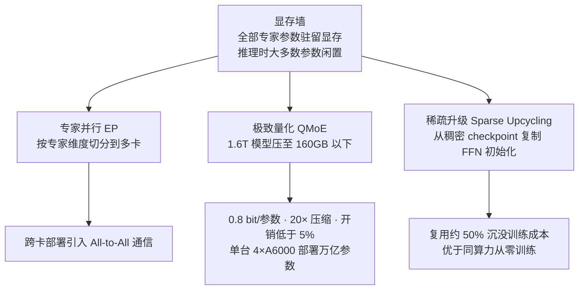

# MoE显存墙与量化压缩

## 问题与三条策略

## 核心结论

MoE 需要把**全部**专家参数驻留显存，即便推理时大多数参数闲置——这是 MoE 相对稠密模型**唯一变差**的资源指标（稠密模型的激活参数就是全部参数，MoE 的总参数才是显存基数）。

应对策略有三条，分别切在不同位置：

| 策略 | 切的位置 | 关键数字 | 代价 |
|---|---|---|---|
| **专家并行 EP** | 空间：多卡切分 | — | 引入 [[MoE通信开销与优化路线\|All-to-All 通信]] |
| **QMoE** | 精度：0.8 bit/参数 | 1.6T SwitchTransformer-c2048 → 160GB 以下，20× 压缩，开销 <5% | 需量化校准 |
| **Sparse Upcycling** | 时间：复用已有权重 | 复用约 50% 沉没训练成本 | 起点受限于已有稠密 checkpoint |

**QMoE** 的意义在于首次实现单台 4×A6000 服务器部署万亿参数模型；**Sparse Upcycling** 从稠密 checkpoint 复制 FFN 为专家初始化 MoE，实证优于同算力从零训练。

## 与 [[显存墙]] 的区别

[[显存墙]] 讲的是 KV Cache 的容量与经济性约束（70B/128k 需 320GB），解法是 [[KV Cache分级存储]]；本页讲的是 **MoE 权重本身**的驻留问题，解法是切分、量化与复用。两者都叫「墙」，但压在不同资源上——一个是激活过程产生的缓存，一个是模型自带的参数。

## 相关页面

- [[MoE通信开销与优化路线]]：专家并行引入的通信代价与三层优化。
- [[MoE推理部署与冗余专家]]：推理期的负载与调度问题。
- [[稀疏激活与容量解耦]]：为什么激活参数小、显存却要按总参数算。
- [[MoE与稠密模型对比]]：显存维度上 MoE 与稠密模型的差异。

## 参考来源

- [[raw/papers/MoE.md]]
