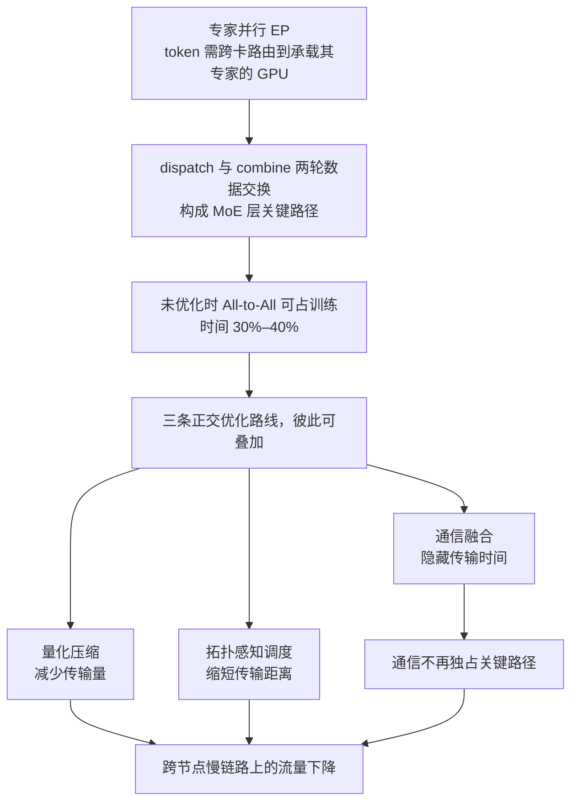
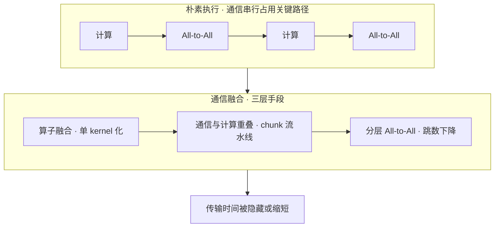
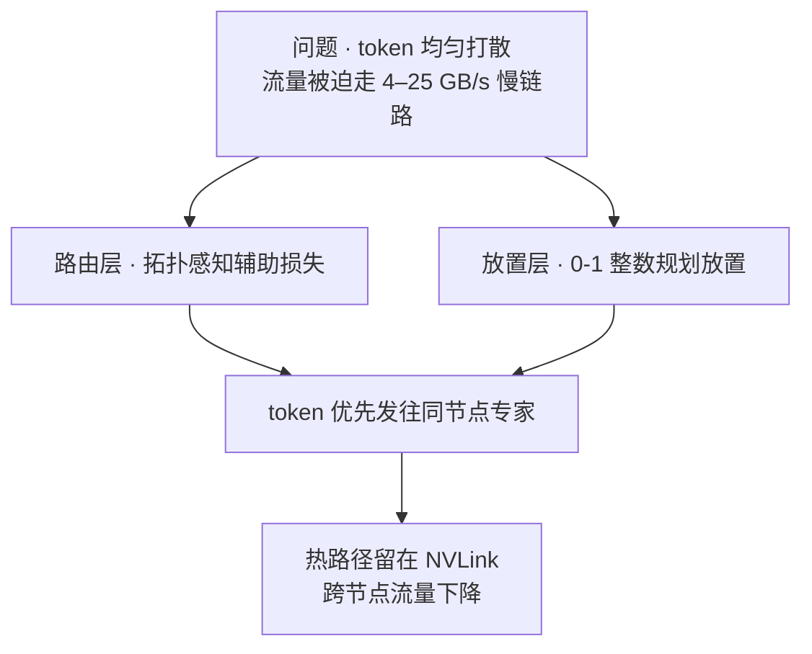

# MoE通信开销与优化路线

## 问题与三条正交路线

## 核心结论

专家并行下，token 需跨卡路由到承载其专家的 GPU，引入 **All-to-All 通信**：每个 rank 同时向所有 rank 发送与接收数据，形成 **dispatch 与 combine 两轮数据交换**，构成 MoE 层的关键路径。NVIDIA Megatron-Core 官方文档指出，**未加优化时仅专家并行的 All-to-All 就可占到训练时间的 30%–40%**。当专家数与 $K$ 较大、专家跨多节点部署时，通信带宽成为瓶颈。

三条路线分别作用在「传多少」「传多久」「走多远」上。

## 路线一：通信融合——把传输藏进计算里

- **算子融合**：门控的 mask、Top-K、cumsum 与稀疏矩阵乘原本是几十次零散 kernel 启动，DeepSpeed-MoE 将其并为单 kernel，并用稠密 token→专家映射表替代稀疏张量，削减启动次数与显存开销。
- **通信与计算重叠**：把 dispatch/combine 切成细粒度 chunk 流水线，使跨卡传输与 attention、FFN 计算并行推进；MegaScale-MoE 在算子内、算子间两个层级做重叠，1440 张 Hopper GPU 训练 352B MoE 达 1.41M tokens/s，较 Megatron-LM 提速 1.88×。
- **分层 All-to-All**：先节点内、再节点间交换，跳数由 $O(p)$ 降至 $O(G + p/G)$（$p$ 为总卡数、$G$ 为单节点卡数）；通信量虽约翻倍，但小 batch 下通信是**延迟受限而非带宽受限**，净效果更快。同工作还借张量并行的数据复制，把 All-to-All 限制在共享同一张量并行 rank 的设备子集内，延迟由 $O(p)$ 降至 $O(p/L)$（$L$ 为张量并行度）。

## 路线二：量化压缩——让每个 token 传得更省

All-to-All 传的是**激活而非权重**，BF16 下每维 2 字节，改用 FP8 传输即减半，且不动模型结构与路由逻辑。MegaScale-MoE 据此以 FP8 All-to-All 替换正向的 BF16 reduce-scatter、以 FP8 all-gather 替换反向，归约仍在 FP32 进行；BF16 混合精度下再把跨节点参数同步由 FP32 降到 BF16，同步开销减半。代价是量化误差，需合适的 scale 策略与 FP32 归约保证收敛稳定。

## 路线三：拓扑感知调度——让热路径留在快链路上

节点内 NVLink 远快于节点间网络，TA-MoE 实测后者仅 4–25 GB/s 且波动明显；朴素 All-to-All 却把 token 均匀打散，大量流量被迫走慢链路。

- **路由层**：让 token 优先发往同节点专家——TA-MoE 以拓扑感知辅助损失实现该偏置且不损精度，较 DeepSpeed-MoE 提速 1.01–1.61×、较 FastMoE 提速 1.01–4.77×。
- **放置层**：决定专家常驻哪张卡——Sivtsov 等将其建模为 0-1 整数规划，兼顾专家负载统计与网络跳数以最小化 token 期望传输次数，在 DeepSeekMoE 16B 与 DeepSeek-R1 671B 上流量均低于各对比基线。

三类手段彼此正交、可叠加使用。

## 相关页面

- [[MoE显存墙与量化压缩]]：量化用在**权重**上省显存，与本页 FP8 量化用在**激活传输**上是两件事。
- [[MoE推理部署与冗余专家]]：训练侧通信之外的推理侧负载问题。
- [[无辅助损失的专家偏置]]：路由层偏置手段的另一用途（负载均衡）。
- [[稀疏激活与容量解耦]]：专家容量约束与通信量的关系。

## 参考来源

- [[raw/papers/MoE.md]]
