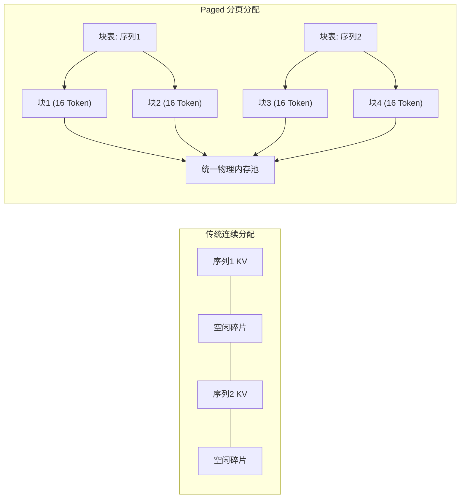

# PagedAttention分页内存

## 分页与连续分配对比

## 核心结论

朴素 KV 缓存按「最大上下文长度」**预分配连续显存**，实际利用率仅 20%–40%，内部与外部碎片合计浪费 60%–80%。PagedAttention 借鉴操作系统虚拟内存：把 KV 切成默认 16 Token 的**固定物理块**，由**块表**维护「逻辑块 → 物理块」映射，物理块散落各处、按需分配用完即还——碎片因此被消除。

## 三段映射

- **逻辑块**：序列视角上完全连续，用户感知的仍是完整 KV；
- **块表（页表）**：记录每个逻辑块对应的物理块编号，是解耦的关键；
- **物理块**：在显存中非连续，按需分配、用完即还。

正因为物理与逻辑解耦，序列长度可以动态伸缩而不必预留最大长度，也才支持**写时复制（Copy-on-Write）**——同一 Prompt 的多采样分支共享前缀物理块，只在写入时才分裂。

## 核心收益

- 内存浪费 60%–80% → **4% 以下**，利用率提升至 **96% 以上**；
- Copy-on-Write 使同 Prompt 多采样共享前缀，beam search 场景显存节省可达 **55%**；
- 自动前缀缓存对前缀序列做哈希（`hash(前缀 + 块索引)`）实现物理块全局复用，相同系统提示词无需重复计算与存储；
- 与连续批处理（Continuous Batching）互为使能：KV 块可独立调度、无需连续对齐，请求得以动态加入退出，GPU 利用率大幅提升。

该技术由 vLLM 团队于 2023 年提出，已成为工业界推理框架的标准配置。

## 相关页面

- [[vLLM]]：提出并首发 PagedAttention 的推理引擎
- [[前缀缓存与PagedAttention]]：块共享与跨请求前缀复用的另一面
- [[KV Cache优化技术栈总览]]：系统管理层在五级栈中的位置
- [[显存墙]]：碎片浪费放大后的容量压力

## 参考来源

- [[raw/papers/KV Cache.md]]
