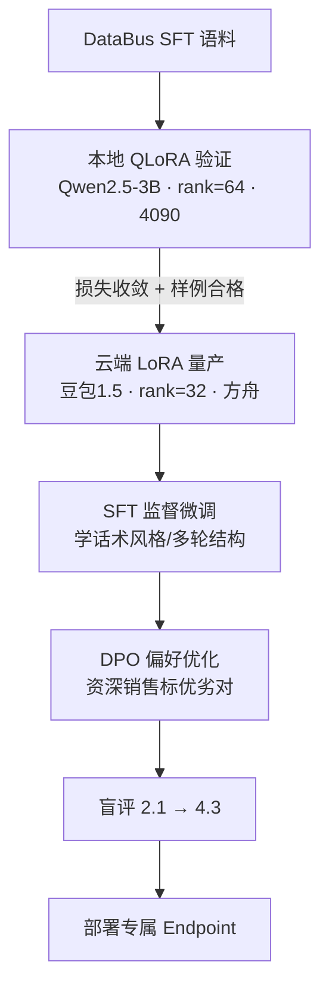

# QLoRA与LoRA微调

## 微调链路

## 核心结论
- **LoRA**：冻结大模型权重，只训练**低秩适配器**，参数高效；**QLoRA** 再对基座权重做量化（4bit）进一步降显存，单卡 4090 可跑 3B 级模型快速试数据。
- **两阶段策略**：本地**便宜快跑**验证数据和超参 → 云端**规模化量产**；本地 rank=64/lr=2e-4（验证期快收敛），云端 rank=32/lr=1e-5（防过拟合、对齐基座）。
- **SFT + DPO**：SFT 模仿销售对话解决"话术不像"；DPO 让销售标注优劣对优化引导；小样本下 DPO 比 RLHF 更稳（省去奖励模型+PPO），盲评 2.1→4.3。

## 要点拆解

### 参数含义
| 参数 | 含义 | 简历口径 |
|------|------|----------|
| rank | LoRA 矩阵秩，越大表达力越强 | 本地 64 验证，云端 32 量产防过拟合 |
| alpha | 缩放系数，常设 2×rank | 本地 alpha=128 |
| lr | 学习率 | 本地 2e-4 快跑，云端 1e-5 稳收敛 |

### SFT vs DPO
- **SFT**：模仿商城销售对话，解决逻辑不通、话术不像；学习多轮结构。
- **DPO（偏好优化）**：同一 prompt 模型/人工生成 2~4 条候选 → 资深销售标 preferred/rejected → `(prompt, chosen, rejected)` 对直接优化策略。
- **为何不用 RLHF**：需要单独奖励模型 + PPO，小样本不稳定、成本高；DPO 数百条标注即可。

### 为什么 QLoRA 而非全量微调
- 全量微调贵、显存需求大；QLoRA **显存友好**，本地可迭代，避免云端每轮烧钱。
- 灾难性遗忘：LoRA 只改少量参数 + 基座冻结，遗忘较全参轻；仍用 held-out 集监控。

### 评测与上线门禁
| 阶段 | 指标 |
|------|------|
| 本地 QLoRA | loss、样例人工扫、泄露检测 |
| 云端 SFT | 盲评话术分、Care 条款准确率 |
| DPO 后 | 盲评 2.1→4.3、转化引导 case |
| 上线 | 灵购 TTFT + 端到端灰度 |

## 相关页面
- [[ModelForge-AI]]：本技术的主落地项目
- [[微调与RAG分工]]：微调的定位（话术风格）与 RAG 互补
- [[DataBus]]：SFT 语料来源
- [[TTFT首字延迟优化]]：微调精简 system 对 TTFT 的收益

## 参考来源
- [[贸易AI业务]]