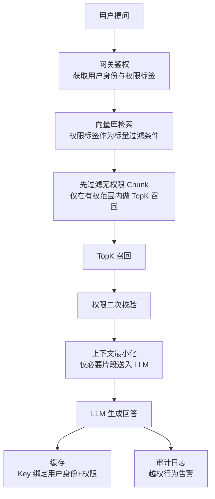

# RAG权限隔离全链路架构

## 流程总览

图 1 全链路权限隔离架构流程图

## 核心结论

- **核心原则**：权限拦截放在数据层，不依赖大模型 Prompt 约束。大模型是概率模型，存在提示词注入和幻觉，把安全交给模型自律不可靠。
- **五层管控**：入库绑权限 → 检索前置过滤 → 上下文最小化 → 缓存隔离 → 越权审计，覆盖数据流各阶段。
- **反面方案**：Prompt 限制存在三大缺陷——提示词注入可覆盖约束、幻觉致无视约束、敏感 Chunk 进上下文即暴露。

## 要点拆解

### 为什么 Prompt 限制不够
1. **提示词注入**：恶意输入可覆盖 Prompt 中的约束指令
2. **幻觉效应**：模型可能无视约束直接输出敏感内容
3. **暴露面失控**：敏感 Chunk 一旦被召回进入上下文，数据便已暴露——风险在召回阶段即已产生

### 五层管控职责
| 层级 | 职责 | 目标 |
|------|------|------|
| 文档入库 | 权限元数据绑定，Chunk 继承 | 检索时不丢失权限 |
| 检索前置过滤 | 向量引擎层标量过滤 | 只召回有权 Chunk |
| 上下文最小化 | 二次校验 + 只给必要片段 | 缩减暴露面 |
| 缓存隔离 | Key 绑定用户身份+权限 | 防止跨用户泄露 |
| 审计监控 | 全量日志 + 越权告警 | 事后溯源 |

## 相关页面

- [[检索前置过滤机制]]：核心机制详解
- [[权限元数据绑定]]：入库层实现
- [[上下文最小化]]：上下文层实现
- [[缓存隔离]]：缓存层实现
- [[审计与越权监控]]：审计层实现
- [[分层权限模型]]：三层权限粒度
- [[LLM权限最小化]]：LLM 场景权限最小化原则
- [[RAG检索优化五层]]：RAG 检索优化五层组合拳

## 参考来源

- [[raw/papers/RAG知识库权限隔离.md]]
