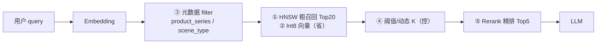

# RAG检索优化五层

## 流程总览

## 核心结论
- 五层记忆卡：**HNSW 要快，Int8 要省，元数据要准，TopK 要控，Rerank 要精**。
- 标准口径：Milvus **粗召回 Top20 → 元数据四维过滤 → rerank 精排 Top5**；命中率约 **72%→89%**，检索耗时约降到原来 **1/4**。
- 「别只说调了 Milvus 参数」——要说五层组合拳；「别说 100% 准确」——口径是 72%→89%。

## 要点拆解

| 层 | 手段 | 解决什么 |
|----|------|----------|
| ① | HNSW 图索引 | 全库暴力搜太慢，毫秒级在线召回 |
| ② | Int8 量化 | float32→int8，存储约 ↓75% |
| ③ | 元数据 filter | 向量像但不业务相关；四维标签先过滤 |
| ④ | 召回策略 Top20 | TopK 太多拖慢 LLM；阈值/动态 K |
| ⑤ | Rerank Top5 | 机型/Care 等近义混淆 |

### HNSW（快）
- FLAT 与每条向量算距离随数据量线性变慢；HNSW 分层图导航近似最近邻，适合百万级在线。
- 参数记忆：`M`、`efConstruction` 建索引（离线），越大质量越好建得越慢；`ef` 在线查询，越大越准越慢，语音场景压测选 32~128。

### Int8（省）
- float32 每维 4 字节，1024 维 ≈4KB/条，百万条仅向量数 GB；Int8 每维 1 字节，存储约省 75%。
- 与 HNSW **叠加使用**（在量化向量上建索引）；建库和查库用**同一套量化规则**；精度损失靠第五层 rerank 补；上线前验证 float vs Int8 Top20 重叠率 >90%。

### 元数据过滤（准）
- 四维字段：`product_series`（防跨机型）、`accessory_model`（配件精确匹配）、`scene_type`（防 Care 搜到种草文案）、`activity_id`（防过期/错误活动）。
- filter 来源：关键词规则 + 槽位抽取 + 多轮上下文；抽不到则**放宽 filter 防漏召回**。

### 召回策略（控）
- 手段：`limit=20` 粗召回、`ef` 联动调参、相似度阈值丢弃低分、动态 K（FAQ Top10 / 复杂 Top20-30）、空结果逐级放宽 filter。
- 过滤管「该不该进池子」，rerank 管「池子里谁排前」。

### Rerank（准 — 最终选谁）
- **Cross-Encoder 精排**：输入 `(query, doc)` 原文文本对联合打分，**不涉及向量**；粗召回 Bi-Encoder vs 精排 Cross-Encoder。
- **轻量 base-rerank**：对召回已有的 dense_score/sparse_score 加权（`w_dense·dense + w_sparse·sparse + w_meta·meta`），适合极低延迟，可 A+B 组合。
- 效果：命中率 72%→89%；只对 20 条打分，延迟可接受。

## 相关页面
- [[Hybrid混合检索]]：粗召回阶段 Dense+Sparse 融合，与五层叠加
- [[灵购AI]]：五层的落地场景（在线检索）
- [[DataBus]]：chunk 数据模型与分段质量影响召回
- [[ModelForge-AI]]：提供 Cross-Encoder 精排能力

## 参考来源
- [[贸易AI业务]]