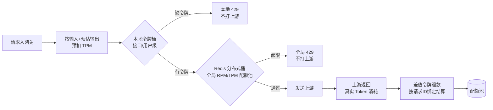

# RPM与TPM联合令牌桶

## 令牌生命周期

## 核心结论
- **两级令牌桶**：`本地桶`（单实例内存态，无网络 IO，接口/用户级快速路径）做高频预拦截；`Redis 分布式桶`（全局权威配额池）做最终判定，解决多实例本地桶**配额超发**。
- 配额计费：`预扣预估 Token + 响应后令牌退款`——请求入网关按「输入长度 + 预估输出长度」扣减 TPM，上游返回真实使用量后返还差值。
- **退款按请求 ID 绑定**：结算单位是该请求最终实际消耗的最后一次上游调用，切换节点不会造成预估与真实差额的多节点重复计费。
- 令牌生成速率依据上游服务商 RPM/TPM 配额动态设定；令牌耗尽时本地预拦截，避免无效网络 IO。

## 要点拆解

### 为什么不能用单机内存桶
多网关集群若各持内存桶，节点各自按配额满额发放，合计会**超发上游配额**，被上游按全局口径限流。Redis 分布式桶做唯一权威，各节点共享同一配额视图。

### 预扣+退款解决什么
TPM 是按 Token 计费的慢配额，请求还没出去就无法知道最终消耗。先按**输入长度 + 预估输出长度**估算扣减（估算公式 $E = \alpha \cdot |input| + \beta \cdot |output|$，$\alpha$/$\beta$ 按模型校准），防止瞬时流量把 TPM 打爆；真实 usage 回流后返还差值修正精度。

### 两级桶的分工边界
- 本地桶：未命中即本地返回，不产生 Redis RTT 开销。
- Redis 桶：本地桶未命中时仍需精确扣减；本地桶可短期超额放行上游可用份额，最终校验交给 Redis。

## 相关页面
- [[双层网关架构]]：令牌桶在 AI 网关层的定位
- [[429流量治理]]：令牌耗尽后的 429 分类与配额感知切换
- [[LLM网关动态路由与流量治理总览]]：配额建模的总览视角

## 参考来源
- [[raw/papers/面向大模型服务的动态路由与流量治理架构研究.md]]