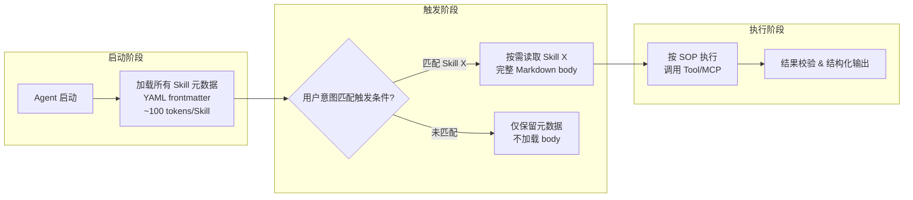

# SKILL.md规范

## 渐进式披露（Progressive Disclosure）



<p align="center"><b>渐进式披露启动→触发→执行三阶段</b></p>

## 核心结论
- SKILL.md 的核心设计是**渐进式披露**：启动仅全量加载 frontmatter 元数据（约 100 tokens/Skill），用户意图匹配触发条件后才按需读取 body 完整流程 [[raw/papers/AI-Agent-Skill工程化.md]]。
- **Token 经济性**：$C_{pd} = N \times T_{meta} + k \times T_{body}$（$k$ 为实际触发数），相比全量加载 $C_{full} = N \times T_{body}$；当 $N=50$、$T_{body}=2000$、$k=1$ 时节省率高达 **98%** [[raw/papers/AI-Agent-Skill工程化.md]]。
- 生命周期对应 Google Agent Skill 指南的三阶段：**Discovery（发现）→ Activation（激活）→ Execution（执行）**。

## 要点拆解

### YAML frontmatter 元数据层
| 字段 | 说明 |
|------|------|
| `skill_id` | 英文小写、横线分隔唯一标识 |
| `version` | 语义化版本号 |
| `triggers` | 触发条件：指令模式、场景关键词 |
| `priority` | normal / high / fallback |
| `dependencies` | 依赖的 Tool / MCP 服务名 |
| `applicable_agents` | 适用 Agent 平台 |

### Markdown body 流程文档层（11 大模块）
简介 → 适用场景（有效+禁止）→ 技能目标 → 前置依赖 → 核心执行流程 SOP → 分支判断（正向/负向/超时异常）→ 约束与安全规范 → 输入输出规范 → 错误码与兜底 → 正向+反向示例 → 版本记录 [[raw/articles/技能与工具开发问题.md]]。

### 标准目录结构
```
[skill-name]/
├─ SKILL.md          # 核心技能规则文件
├─ config.json       # 可选：技能配置、参数默认值
├─ examples/         # 可选：示例用例
└─ assets/           # 可选：依赖资源、参考文档
```

## 相关页面
- [[Skill工程化总览]]：Skill 工程化的规范起点
- [[Skill架构模式]]：规范之上的模式分类
- [[Skill质量治理]]：对规范合规性的评审视角
- [[Skills技能]]：组织制度知识视角的 SKILL.md 机制
- [[Skill工程化总览]]：Meta-Skill 路由（大规模 Skill 生态的路由机制）在工程化框架中的位置

## 参考来源
- [[raw/papers/AI-Agent-Skill工程化.md]]
- [[raw/articles/技能与工具开发问题.md]]（标准模板 + 最简落地目录结构）