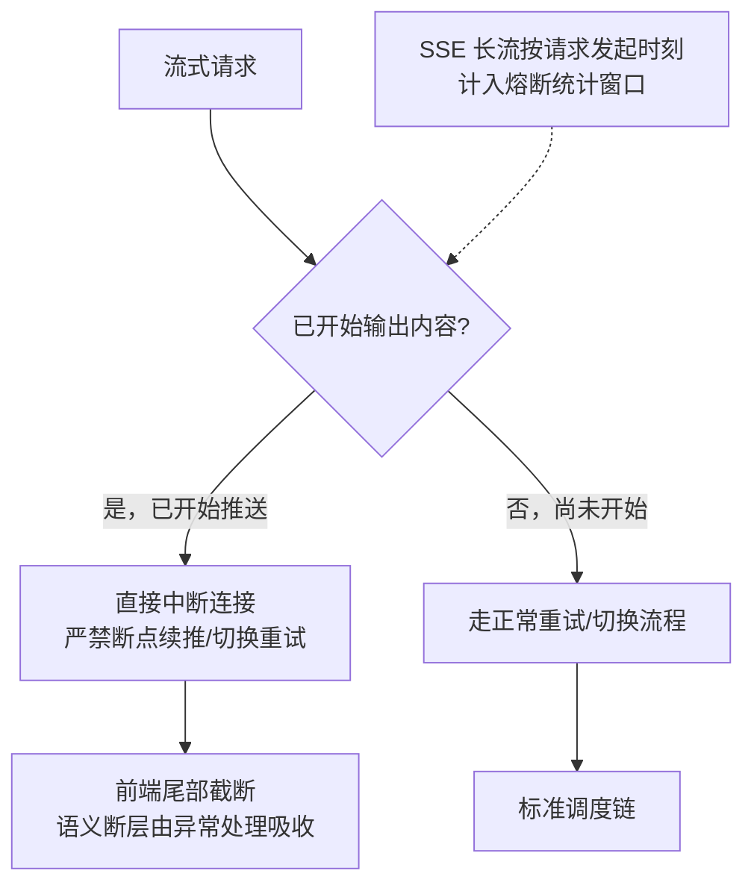

# SSE流式容错

## 流式旁路逻辑

## 核心结论
- **已开始推送数据的 SSE，中途 429/5xx → 直接中断连接，严禁断点续推、严禁切换节点重试**。否则前端拼接会出现语意断层或内容重复。
- 未开始输出时，SSE 可走正常重试/切换流程（此时与普通请求无异）。
- **统计口径**：SSE 长流以请求**发起时刻**计入熔断滑动窗口，而非流结束时刻——避免长耗时流式请求把错误延迟上报，掩盖时效性。
- 与 [[TTFT首字延迟优化]] 呼应：SSE 是首字即回 RTC 的流式通道，本页解决的是这条通道中途断流的容错策略。

## 要点拆解

### 为什么「续推/重试」是禁忌
流式输出是按序拼接的 token 流，若中途断了然后换节点重试，新节点从头生成会把前面已输出的内容又推一遍 → **重复**；继续推则与新节点内容不连贯 → **断层**。无论哪种都让前端文案语义错乱，且对调用方毫无价值。

### 中断后前端怎么办
中断信号（error/close 事件）由调用方 SSE 客户端捕获，做尾部截断与降级提示，属于上层业务处理，不在网关职责内兜底。

### 非幂等长请求
计费/文件上传类 SSE 属 [[重试预算与幂等保护]]：异常绝对禁止重试，防重复扣费或数据不一致。

## 相关页面
- [[TTFT首字延迟优化]]：SSE 流式在链路中的位置
- [[重试预算与幂等保护]]：非幂等与长上下文的重试约束
- [[双层网关架构]]：SSE 旁路挂在 AI 网关层
- [[熔断器状态机]]：SSE 特有的统计口径

## 参考来源
- [[raw/papers/面向大模型服务的动态路由与流量治理架构研究.md]]