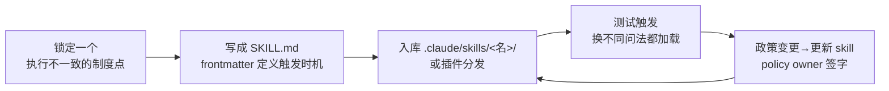

# Skills技能

## 生命周期

## 核心结论
- Skill 是组织把**制度知识（institutional knowledge）变成可操作指令**的载体：显式、版本化、广泛适用、政策变更时中心化更新 [[The AI-Native SDLC playbook]]。
- 触发条件写在 `SKILL.md` 的 frontmatter（何时自动加载），主体写怎么执行；以文件夹形式放 `.claude/skills/<name>/` 随代码分发，或经插件生态组织级分发。
- **建议性控制**：skill 让 agent 在写代码时**大概率**遵循政策，但不强制任何会话遵守；规则必须始终成立时，需要 [[Hooks护栏与审批门]] 这类确定性执行兜底（violations rare by skill，close to impossible by hook）。

## 要点拆解
- **选材原则**：为"必须被一致执行的制度知识"写 skill；属于"团队上下文"的放 [[CLAUDE记忆文件|CLAUDE.md]]，一次性提示不固化。
- **写法示例**：安全 API 评审 skill，frontmatter 声明"创建/修改外部端点、评审 API 代码、生成 OpenAPI spec 时触发"，正文给认证、输入校验、审计、PII 分类四条铁律 + 运行校验脚本的输出要求 [[The AI-Native SDLC playbook]]。
- **测试与治理**：每次用不同问法验证触发；政策变化时由 policy owner 签字后更新；调用记录进 session trace；skill 文件变更像代码一样评审。
- **与 hooks 的分工**：skill 不能拦截动作——需要禁止时，由 hook `allow / ask / block`；skill 让违规稀有，hook 让违规近乎不可能。

## 相关页面
- [[CLAUDE记忆文件]]：团队上下文（CLAUDE.md）与制度知识（skill）的边界
- [[Hooks护栏与审批门]]：建议性控制背后的确定性层
- [[AI-native-SDLC]]：skill 在六阶段中的嵌入位置

## 参考来源
- [[The AI-Native SDLC playbook]]