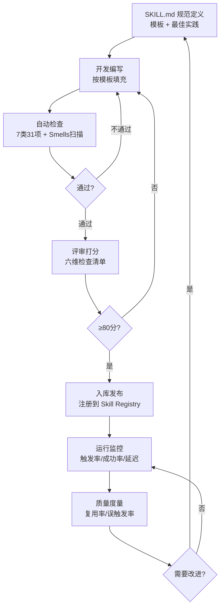

# Skill质量治理

## 质量治理闭环

<b>定义-评审-度量-改进治理闭环</b>

## 核心结论
- Skill 质量评审覆盖 **六维 100 分**：SOP 完备性 25、意图触发 20、输出结果 20、安全约束 15、性能开销 10、可维护性 10 [[raw/articles/技能与工具开发问题.md]]。
- 权重体现经验排序：SOP 完备性最高（机器可执行基础）、意图触发次之（误触发浪费资源）、输出与安全并重。
- 大规模实证（138,000 份 SKILL.md）归纳 **七类 31 项**可复用性检查；高复用 Skill 的误触发率 <5%、SOP 分支覆盖 ≥90%、Tool 依赖声明 100% [[raw/papers/AI-Agent-Skill工程化.md]]。

## 要点拆解

### 六维检查清单（摘要）
| 维度 | 分值 | 关键检查点 |
|------|------|-----------|
| 意图触发 | 20 | 触发描述无歧义 / 有效+禁止场景完整 / 不高频误触发 |
| SOP 完备性 | 25 | 步骤可机器执行 / 参数缺失追问 / 四分支齐全 / 标明 Tool 依赖 / 重试降级 |
| 输出结果 | 20 | 参数表完整 / 输出结构化 / 成功判定标准 / 状态与风险提示 |
| 安全约束 | 15 | 高危人工确认 / 禁止越权 / 敏感信息防护 / 防循环调用 |
| 性能开销 | 10 | 无冗余长文本 / 调用轮次合理 |
| 可维护性 | 10 | 元数据齐备 / 正反示例 / 职责边界清晰 |

### 反面模式（Smells）三级
- **致命级（阻塞执行）**：缺失触发条件 / SOP 缺失 / 无异常分支
- **严重级（降低质量）**：触发条件过宽 / Tool 依赖不明 / 输出无结构
- **一般级（影响维护）**：版本记录缺失 / 示例缺失 / 职责越界（Skill 内含原子 Tool 逻辑）

## 相关页面
- [[SKILL.md规范]]：治理的对象与标准
- [[Skill架构模式]]：职责边界/单一职责与治理互证
- [[Skill工程化总览]]：质量治理在工程化框架中的一环
- [[Skills技能]]：#专业制度知识的评审与治理（SDLC 视角）

## 参考来源
- [[raw/papers/AI-Agent-Skill工程化.md]]
- [[raw/articles/技能与工具开发问题.md]]