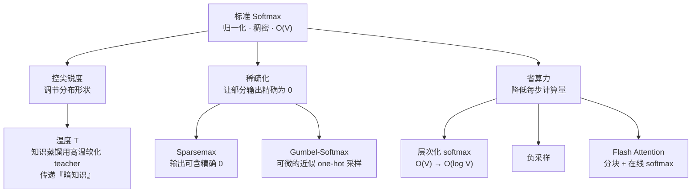

# Softmax变体族谱

## 三条改造动机

## 核心结论

主要变体可按改造动机分成三族：

- **控尖锐度**：温度；知识蒸馏用**高温**软化 teacher 输出，传递「暗知识」。
- **稀疏化**：**Sparsemax** 输出可含精确 0；**Gumbel-Softmax** 实现可微的近似 one-hot 采样。
- **省算力**：**层次化 softmax** 把 $O(V)$ 降到 $O(\log V)$、**负采样**、**Flash Attention**。

**变体本质都是在牺牲标准 softmax 的某条性质，换取特定收益**——反衬出标准版的地位。这也是 [[Softmax候选方案对比]] 中「四条约束全通过」这一结论的延续：一旦愿意放弃某一条，立刻长出一整族变体。

## 与既有页面的接续

| 变体 | 放弃了什么 | 换到了什么 | 相关页面 |
|---|---|---|---|
| 温度 / 蒸馏 | 分布的确定性 | 可调的尖锐度与可迁移的知识 | [[温度参数与生成采样]] |
| Sparsemax | 处处光滑（改为分段线性） | 精确稀疏 | — |
| Gumbel-Softmax | 采样的离散性 | 可微、可反传 | — |
| 层次化 softmax | 全局归一化的简洁 | $O(\log V)$ 的解码速度 | — |
| Flash Attention | 单次全量计算 | $O(n^2) \to O(n)$ 显存 | [[FlashAttention算子优化]] |

## 相关页面

- [[Softmax归一化原理]]：标准版的性质清单，也是各变体的取舍对象。
- [[Softmax候选方案对比]]：四条约束下的方案淘汰过程。
- [[FlashAttention算子优化]]：省算力一支的工程落地。
- [[Softmax技术全景总览]]：「变体」这一段的落点。

## 参考来源

- [[raw/papers/Softmax.md]]
