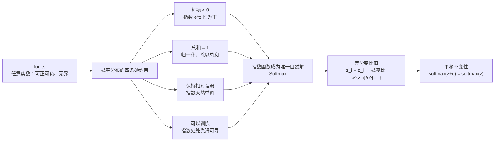

# Softmax归一化原理

## 四条约束逼出唯一解

## 核心结论

模型最后一层输出的 logits 是任意实数，下游需要的却是一个**概率分布**。这座「打分 → 概率」的桥必须同时满足四条：每项为正、总和为一、保持相对强弱、可以训练。

其他候选全被条件逼出局：**线性归一化**除完还有负数，**argmax** 没有梯度，**sigmoid** 各项独立、加总不为 1。而指数函数有一个独特性质——**差分变比值**：

$$
z_i - z_j \;\longrightarrow\; \frac{e^{z_i}}{e^{z_j}}
$$

logit 的加法对应概率的乘法，这是其他函数不具备的。由此还自然导出**平移不变性** $\text{softmax}(z+c) = \text{softmax}(z)$，为 [[Softmax数值稳定性]] 埋下伏笔。

**Softmax 不是被挑选出来的，而是被这些条件逼出来的唯一自然解**——顺带还有指数放大差距的福利，使它成为 argmax 的可导软化版。

## 公式与算例

$$
\text{softmax}(z)_i = \frac{e^{z_i}}{\sum_{j=1}^{K} e^{z_j}}
$$

以 logits `[2.0, 1.0, 0.1, 3.0]` 为例，三步算完：

| 步骤 | 操作 | 结果 |
|---|---|---|
| ① 取指数 | $e^{z_i}$ | `[7.39, 2.72, 1.11, 20.09]` |
| ② 求和 | 归一化分母 | `31.31` |
| ③ 相除 | 逐项除以总和 | `[0.236, 0.087, 0.035, 0.642]` |

输出全正、总和为 1，头部概率被显著放大——这就是「软化的 argmax」。

## 相关页面

- [[Softmax候选方案对比]]：为什么其它候选函数被四条约束逐一淘汰。
- [[Softmax数值稳定性]]：平移不变性的工程价值。
- [[交叉熵与梯度简化]]：训练时 softmax 与损失函数的组合。
- [[Softmax技术全景总览]]：五段主线的入口。

## 参考来源

- [[raw/papers/Softmax.md]]
