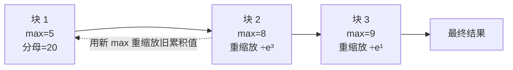

# Softmax数值稳定性

## 分块流式计算

## 核心结论

logit 较大时 $e^{z_i}$ 会溢出（float32 上限约 $e^{88}$）。利用 softmax 的**平移不变性**（整体加减常数结果不变），实现时**先减去最大值**：

$$
\text{softmax}(z)_i = \frac{e^{z_i - \max(z)}}{\sum_j e^{z_j - \max(z)}}
$$

减 max 后指数最大仅为 $e^0 = 1$，**彻底避免溢出**——代价为零，因为结果完全不变。

在此基础上，**online softmax** 支持分块流式计算：每读入一个新块就更新运行最大值与分母，并对旧累积值做重缩放。这是 **[[FlashAttention算子优化]] 的核心技巧**——显存从 $O(n^2)$ 降到 $O(n)$，让长上下文成为可能。

## 两层手段的分工

| 手段 | 解决什么 | 依据 |
|---|---|---|
| 减 max | 指数溢出 | 平移不变性 $\text{softmax}(z+c)=\text{softmax}(z)$ |
| online softmax | 中间结果无法一次装下 | 运行最大值 + 分母的可增量维护 |

平移不变性本身来自指数的**差分变比值**性质，溯源见 [[Softmax归一化原理]]；同一性质的另一处运用是给被掩码位置加 $-\infty$，见 [[注意力缩放与因果掩码]]。

## 相关页面

- [[FlashAttention算子优化]]：online softmax 的工程落地与版本演进。
- [[Softmax归一化原理]]：平移不变性的来源。
- [[Softmax技术全景总览]]：「怎么稳」这一段的落点。
- [[显存墙]]：同一份素材中讨论的容量上限，与本页的中间显存优化互为补充。

## 参考来源

- [[raw/papers/Softmax.md]]
