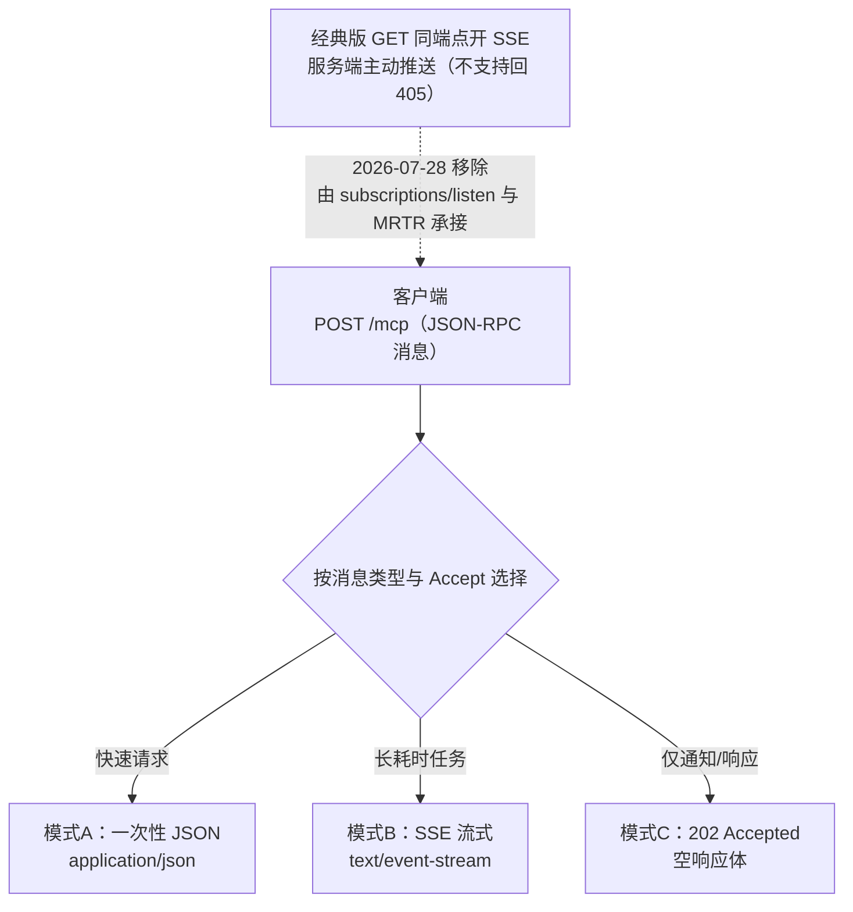

# Streamable HTTP

## 单端点按需流式机制

<b>Streamable HTTP 单端点按需流式机制</b>

## 核心结论

- **一句话定位**：单一 `/mcp` 端点上跑 JSON-RPC over HTTP——短任务直接回 JSON、长任务按需升级 SSE 流；2026-07-28 起彻底无状态，可当普通 Web API 部署在轮询负载均衡之后 [[raw/papers/Streamable HTTP.md]]。
- **概念分层**：Streamable HTTP = HTTP 承载 + JSON-RPC 消息信封 + 可选 SSE 流式下行 + MCP 端点/版本/会话规则；它不是底层新协议，与 SSE、WebSocket 不在同一层次（MCP语义 → JSON-RPC → Streamable HTTP → HTTP/SSE）。
- **演进三阶段**：2025-03-26 首次引入（替代 HTTP+SSE 双端点）→ 2025-11-25 机制完善（会话/断线重连/服务端推送齐备）→ 2026-07-28 无状态重构（MCP 史上最大修订）。

## 要点拆解

### 单端点三条交互规则（经典版）

1. **POST 主干**：每条 JSON-RPC 消息一个 POST，服务端按 Accept 回单个 JSON 或开 SSE 流（承载进度通知与服务端请求）；
2. **GET 推送**：客户端可对同端点 GET 开 SSE 收服务端主动推送，不支持则 405、客户端降级仅 POST（2026 已移除）；
3. **无需回复**：POST 体只含通知/响应 → 202 Accepted 空响应体。

### 有状态经典机制（2025-11-25）

- 三步握手：initialize → InitializeResult（MAY 下发 `Mcp-Session-Id`，客户端 MUST 后续回传）→ initialized 通知；
- 断线重连：SSE 事件带 `id`，重连 GET 携 `Last-Event-ID` 从断点重放错过的消息；
- 会话终止：客户端 DELETE 主动关闭，或服务端 404 迫使重新 initialize。

### 2026-07-28 无状态重构

- **移除**：`Mcp-Session-Id`、initialize 握手、GET 推送通道、`Last-Event-ID` 重连、DELETE 终止——每个 HTTP 请求自包含、服务端可独立处理；
- **新增**：`Mcp-Method`/`Mcp-Name` 路由头（网关免解析请求体即可路由/限流）、每请求 `MCP-Protocol-Version` + `_meta` 元数据、`server/discover` 按需发现（版本不支持回错误码 `-32022`）；
- **服务端主动消息**：SSE 长连接回调倒置为 MRTR 重试循环（`input_required` 中间结果 → 客户端携 `inputResponses` 重试 → `complete`）；广播走 `subscriptions/listen` 订阅流；长任务走 tasks 扩展轮询；
- **收益与代价**：无粘性路由、轮询 LB 即可扩缩容、Serverless 原生适配；断线恢复下沉应用层——响应流中断即整单重试，有副作用工具必须幂等键（迁移测试不报错的静默退化）；
- **双栈兼容**：同一 `/mcp` 可 dual-era——带 `_meta` 的现代请求走无状态语义、`initialize` 走旧语义，时代判定按服务器进程/源缓存。

### 与相邻概念的边界

- **vs 自研 POST+SSE**：差的不是几个 header，而是整套交互约定（JSON-RPC 信封、版本协商、会话/断线语义）；
- **vs WebSocket**：请求驱动按需流式 vs 持久全双工长连接；官方选型 Streamable HTTP 是网关/WAF/Serverless 基础设施兼容性权衡，而非能力不足。

## 相关页面

- [[MCP协议架构]]：Streamable HTTP 是其传输层演进的当前形态
- [[MCP网关]]：Mcp-Method/Mcp-Name 路由头支撑网关免解析路由
- [[断线续传]]：Last-Event-ID 机制及 MCP 2026 移除它的对照案例
- [[重试预算与幂等保护]]：静默退化场景下幂等键的必要性
- [[SSE流式容错]]：模式B SSE 通道的断流容错语境
- [[Function Tool与MCP Tool对比]]：MCP Tool 的远程部署方式
- [[Streamable HTTP·素材摘要]]：本页所源论文的要点摘录

## 参考来源

- [[raw/papers/Streamable HTTP.md]]
