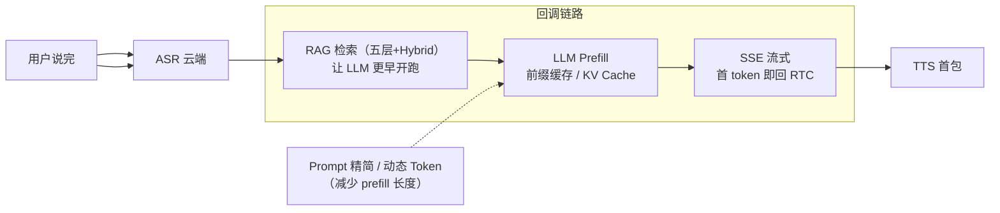

# TTFT首字延迟优化

## 优化全景

## 核心结论
- **TTFT = Time To First Token**：LLM 从收到请求到吐出第一个 token 的时间；简历「首字符 15s→2s」指**回调链路 + LLM 推理侧**的整体优化。
- 五类手段分工：**RAG 减少「首 token 之前」的空等；前缀缓存/KV Cache 减去「prefill 重复计算」；prompt 精简与动态 Token 缩短输入；SSE 让首 token 一到就往下游送**。
- 三个坑：别说手写 KV Cache 内核（平台内置）；别说 RAG 正文能跨请求全缓存（变的部分每轮重算）；TTFT 特指 LLM 首 token，全链路还要加 ASR/TTS。

## 要点拆解

### 手段全景表
| 类别 | 手段 | 作用 |
|------|------|------|
| 链路前段 | RAG 五层 + Hybrid | 检索从慢变快，LLM 更早被调用 |
| Prompt | 统一结构、微调后精简 system | Prefill 变短 |
| 缓存 | 前缀缓存 + KV Cache | 少算重复内容 |
| Token 策略 | 动态分级、RAG 只 Top5 | 输入更短，prefill 更快 |
| 工程 | SSE 流式回 RTC | 首 token 一到就送下游，体感更低 |

### 前缀缓存（跨请求）
- 多轮/RAG 场景 prompt 有大量**固定前缀**（system、回复格式、商城话术模板），推理引擎缓存其 KV，下次前缀相同跳过重复计算。
- 触发方式：统一 system 与 RAG 拼接格式（如「### 参考知识库」固定模板）；部署在火山方舟/豆包等支持 Prefix Caching 的推理端。
- 注意：RAG Top5 每轮变的部分**不能跨请求缓存**，靠 Top5 控长 + 精简 prompt 兜住。

### KV Cache（单请求）
- 自回归生成每产出一个 token 都要对历史做 Attention；KV Cache 存历史 Key/Value，只算新 token 与历史的注意力，是**流式 decode 标配**。
- 与前缀缓存区分：KV Cache 是**单请求内**必备；前缀缓存是**跨请求复用**相同前缀的 KV，主要降首 token 的 prefill。
- 表述口径：「充分启用（平台内置）、通过 prompt 设计触发前缀缓存」，不是「手写实现」。

### 其他手段
- 微调模型减 prompt：话术进模型，system 可缩短。
- 动态 Token 分级：简单问法少给 RAG 条数/历史，复杂咨询才给满。
- SSE：首 token 生成即 yield 给 RTC。
- 测量口径：回调服务打点「LLM 请求发出 → 首个 SSE chunk 到达」，分复杂/简单 query。

## 相关页面
- [[RAG检索优化五层]]：TTFT 的前段（检索变快 = LLM 更早开跑）
- [[灵购AI]]：TTFT 落地的语音客服场景
- [[FEC与自适应JitterBuffer]]：听得稳，与 TTFT 分属不同层级
- [[商城AI业务矩阵]]：同属「答得快」优化主线
- [[SSE流式容错]]：SSE 是 TTFT 首字即回的流式通道，本页解决该通道中途断流的容错策略

## 参考来源
- [[贸易AI业务]]