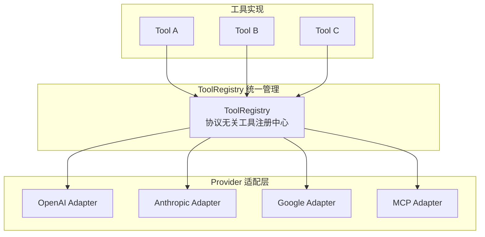

# ToolRegistry跨框架互操作

## ToolRegistry 架构

<b>ToolRegistry 跨框架统一管理</b>

## 核心结论
- 关键洞察：**所有 tool call 结构上都是 RPC**（Remote Procedure Call）——无论本地进程还是远程，本质都是"函数名 + JSON 参数 + 序列化结果" [[raw/papers/Function-Calling与MCP-Tool设计.md]]。
- ToolRegistry 是协议无关的工具管理库，统一接口下适配 OpenAI、Anthropic、Google、MCP 等多个 Provider。

## 三大设计原则
- **协议解耦**：工具实现与调用协议分离，同一工具可同时注册为 Function Tool 和 MCP Tool。
- **Schema 统一**：所有工具参数 Schema 用统一 JSON Schema 表达，各 Adapter 运行时转换成对应 Provider 格式。
- **运行时路由**：根据当前 Agent 框架自动选择合适调用路径。

## 跨 Provider 差异（Adapter 屏蔽的对象）
| Provider | 工具定义 | 调用策略控制 |
|----------|----------|--------------|
| OpenAI | `tools[].function` | `tool_choice`（auto/required/specific）+ strict 模式 |
| Anthropic | `tool_use` content block | `tools[]` 顶层定义、`tool_result` 返回 |
| Google | `function_declarations` | `auto`/`any`/`none` 模式 |

## 相关页面
- [[Function Calling三阶段模型]]：ToolRegistry 是跨框架调用的底座
- [[MCP协议架构]]：其中一种 Provider 协议
- [[Function Tool与MCP Tool对比]]：两种 Tool 形态的选型
- [[结构化输出与Tool抑制]]：Provider 间结构化输出机制的差异点

## 参考来源
- [[raw/papers/Function-Calling与MCP-Tool设计.md]]