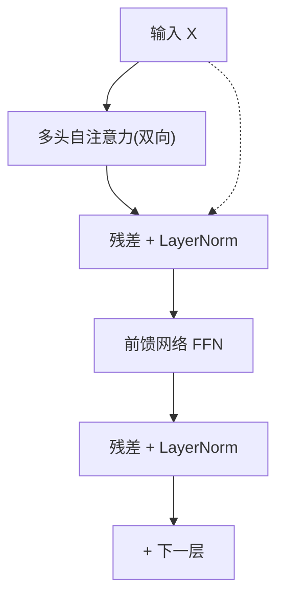

# Transformer编码器结构

## 核心结论
- 编码器每层由**两个子模块**组成：多头自注意力（双向）+ 前馈网络 FFN，都配残差连接 + LayerNorm [[raw/articles/Transformer原理.md]]。
- 双向自注意力：每个位置可看到整句所有 token，适合上下文理解类任务（BERT、RoBERTa 只保留编码器）。

## 编码器层结构

<b>编码器单层：自注意力→残差LN→FFN→残差LN</b>

## 公式与要点

### 层结构公式

$$H' = LayerNorm(SelfAttention(X) + X)$$

$$H = LayerNorm(FFN(H') + H')$$

### 前馈网络 FFN
- 逐 token 独立做两层全连接，token 之间互不影响，本质是每个位置独立的非线性 MLP：

$$FFN(x) = max(0, xW_1 + b_1)W_2 + b_2$$

- 内层维度 $d_{ff} = 2048$（$d_{model}=512$ 的 4 倍）

### Pre-LN vs Post-LN
- **Post-LN**（原始 Transformer）：子层计算完再做 LayerNorm
- **Pre-LN**（GPT、LLaMA）：先 Norm 再进子层，训练更稳定 [[raw/articles/Transformer原理.md]]

## 相关页面
- [[自注意力机制]] / [[多头注意力]]：子模块组成
- [[残差连接与层归一化]]：稳定训练的关键
- [[Transformer解码器结构]]：与编码器的结构差异
- [[Transformer总览]]：编码器在整体架构中的位置

## 参考来源
- [[raw/articles/Transformer原理.md]]