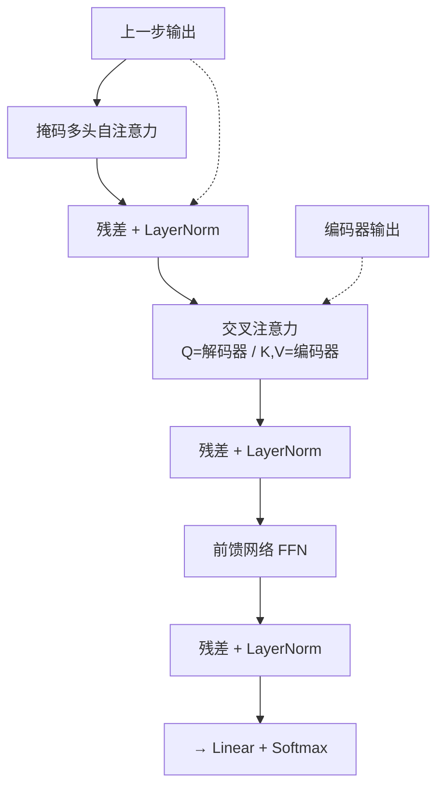

# Transformer解码器结构

## 核心结论
- 解码器每层有**三个子模块**：掩码多头自注意力 → 交叉注意力 → FFN，全部配残差连接 + LayerNorm [[raw/articles/Transformer原理.md]]。
- **掩码自注意力**：只能看到当前及之前生成的 token，看不到未来，保持自回归单向性质。
- **交叉注意力（Cross-Attention）**：Q 来自解码器上一层，K、V 来自编码器输出——生成每个词时参考源句子信息。

## 解码器层结构

<b>解码器单层：掩码自注意力→交叉注意力→FFN</b>

## 关键要点
- **GPT 的简化**：GPT 只用 Decoder 且去掉交叉注意力，只保留 Masked Self-Attention + FFN——没有编码器输入时交叉注意力无意义 [[raw/articles/Transformer原理.md]]。
- **输出层**：Decoder 最后一层 → Linear 映射到词表维度 → Softmax 得到每个词概率 → 采样得到下一个 token，循环生成。
- 掩码把未来位置注意力分数置 $-\infty$，softmax 后权重=0，这是自回归性质的实现关键。

## 相关页面
- [[自注意力机制]]：掩码注意力原理
- [[Transformer编码器结构]]：与编码器的对比
- [[Transformer总览]]：解码器在整体架构中的位置
- [[TTFT首字延迟优化]]：自回归生成本质与 prefill 的关系

## 参考来源
- [[raw/articles/Transformer原理.md]]