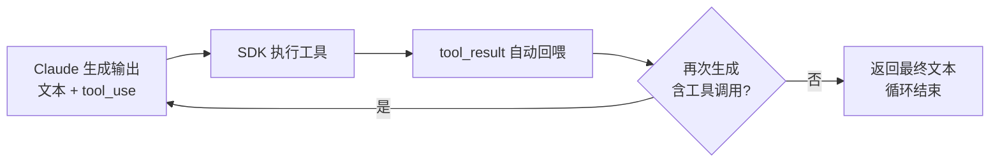

# Turn与消息生命周期

## 核心结论

Turn 是 Agent Loop 的原子单元：一次往返 = Claude 生成输出（文本和/或工具调用）→ SDK（harness）执行工具并收集结果 → 结果自动回喂。重复直到 Claude 产出**不含任何工具调用的最终文本**，循环结束。`max_turns` 只计工具调用轮次。

## Turn 生命周期

## 五类 Message

| 类型 | 含义 |
|---|---|
| SystemMessage | 会话生命周期事件（init / compact_boundary 压缩后 / informational / worker_shutting_down） |
| AssistantMessage | Claude 的文本或工具调用块 |
| UserMessage | 工具执行结果回喂；亦承载流式输入 |
| StreamEvent | 流式输出时的原始 API 事件 |
| ResultMessage | 循环结束标志：最终文本、token 用量、成本、会话 ID |

## 终止状态（ResultMessage subtype）

| subtype | 含义 |
|---|---|
| success | 正常完成（含最终文本 result） |
| error_max_turns | 触顶 max_turns 提前结束 |
| error_max_budget_usd | 触顶 max_budget_usd 提前结束 |
| error_during_execution | 中途错误中断 |
| error_max_structured_output_retries | 结构化输出重试耗尽 |

## 并行工具执行

单 Turn 多个工具调用：只读工具（Read/Glob/Grep/只读 MCP）并发；改状态工具（Edit/Write/Bash）串行避免冲突；自定义工具默认串行，声明 readOnlyHint 后可并行。

## 相关页面

- [[Agent循环]]：循环的整体决策闭环
- [[Agentic Harness]]：完成往返动作的运行时
- [[Agent循环终止与护栏]]：终止协议与硬护栏
- [[Function Calling三阶段模型]]：一个 Turn 内工具调用的内部展开

## 参考来源

- [[raw/papers/Agent Loop.md]]