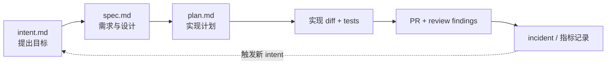

# committed-artifact

## 机制示意

## 核心结论
- **承交付物（committed artifact）**是 AI-native SDLC 的一张主心骨：每个阶段向版本控制提交自己的产物，下一个阶段从读取它开始——实现自动交接、消除手工交接的卡顿 [[The AI-Native SDLC playbook]]。
- commit 链 = **审计轨迹**：谁提出（author+timestamp）、agent 产出什么、谁批准（merge / closing review），全程版本化留存，替代过去散落在文档与审批流里的记录。
- 前端阶段产物是 `.md`（product owner 与 agent 都能读/改同一文件）；从 Build 起产物转为代码及其记录。

## 要点拆解
- **产物序列**：`intent.md`（触发）→ 批准的 intent 触发设计 → `spec.md`（含被标记的 concern）→ 批准后触发 plan → `plan.md`（文件变更/工作顺序/风险/验收证明）→ 实现 diff + 测试 → PR + 评审 findings → incident 记录（含按 [[监控闭环]] 的 sop 分级处理）[[The AI-Native SDLC playbook]]。
- **触发关系**：accepted `intent.md` → 触发 requirements/design pass；approved `spec.md` → 触发 plan mode；merged PR → 触发 pipeline；生产指标破 control band → 写下一个 `intent.md`，循环闭合。
- **格式要求**：intent 模板覆盖 problem / proposed outcome / affected users & systems / constraints / open questions；`.md` 同时服务人和 agent，无需进入 git 的非技术人员可由 connector（如 GitHub 集成）替其提交。
- **实现偏离时**：更新 `plan.md` 同 commit 提交，可用 hook 强制两者同步（[[Hooks护栏与审批门]]）。
- **进入方式**：人工想法 / ticket / 监控告警（incident）都可生成 intent；无论来源，product owner 先审查修正 agent 写出的 `intent.md` 再 commit。

## 相关页面
- [[AI-native-SDLC]]：承交付物的宿主流程
- [[plan模式]]：plan.md 产生的入口
- [[AI代码评审]]：PR 产物进入评审 gate
- [[LLM-Wiki框架]]：同为"AI 编写、人类验收、版本化审计"的编译型范式（commit-msg 钩子强制规范同理）

## 参考来源
- [[The AI-Native SDLC playbook]]