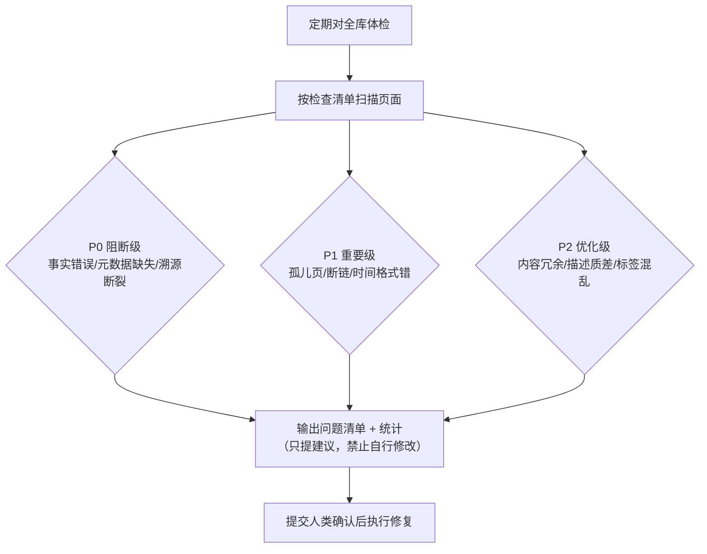

# Lint 工作流

## 流程总览

## 核心结论
- **Lint**（巡检治理）＝定期对全库做质量体检，输出问题清单与统计，**只输出建议、不擅自修改 Wiki 文件**，全部修改等人类确认后执行。
- 三级检查项：**P0 阻断级**（必须立即处理）／ **P1 重要级**（一周内处理）／ **P2 优化级**（月度集中处理）。

## 要点拆解
- **P0 阻断级**：事实错误、观点冲突未标记；`type`/`created_at`/`source` 任一字段缺失；`created_at` 被篡改；`source` 指向的页面已删除或归档（溯源链断裂）。
- **P1 重要级**：孤儿页面（无入链无出链）；正文提及概念但未创建对应页面；时间格式不符合 `YYYY-MM-DD hh:mm:ss`；`description` 缺失。
- **P2 优化级**：内容冗余（建议拆分/合并）；`description` 质量差；`tags` 命名不统一、同义标签爆炸。
- **输出要求**：按优先级输出「页面名 + 问题描述 + 修正建议」，附巡检统计总览（总数/问题数/分类计数）。
- **问题处置策略**：孤儿页→补链或归档；断链→建页或改普通文本；冲突→Agent先核对素材、附采信结论并告知用户，无法调和才交人工；过时→标 `⚠️本内容已过时` 并归档、新建新版；元数据缺陷→从 `shturl.md` 找回真实 `created_at` 补全。

## 相关页面
- [[元数据规范]]：Lint 的校验基准
- [[ingest工作流]] / [[query工作流]]：与 Lint 构成三大闭环工作流
- [[防膨胀闸门]]：Lint 之外的防膨胀机制
- [[三层架构]]：P0 检查项中 source 溯源链所依托的层级结构

## 参考来源
- [[llm-wiki知识库方案]]