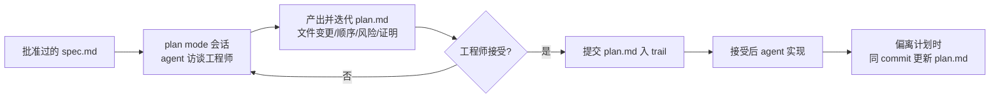

# plan模式

## 流程示意

## 核心结论
- plan 模式是 Claude Code 实现阶段的**默认入口**：工程师用 plan mode 启动会话、给入获批的 `spec.md`，让 agent 访谈自己并迭代出一份实现计划（`plan.md`），接受后才允许改代码 [[The AI-Native SDLC playbook]]。
- 设计上强制"**先设计评审、后生成代码**"：plan mode 下 agent 在工程师接受计划前**不能编辑文件**，因此设计评审发生在改代码成本还只是一次文档编辑的时点。
- plan.md 加入 [[committed-artifact]] 审计链（文件变更、工作顺序、风险、验收证明）；实现偏离计划时同一 commit 更新 plan.md。

## 要点拆解
- **计划的判断标准**：让一个从未看过对话的人**只凭 plan.md 就能实现改动**——此即"计划足够好、可单趟完成实现"的验收线。
- **盘问要点**：这个改动会破坏什么？哪一步风险最高？agent 选择了哪些备选方案、为什么放弃其他？[[The AI-Native SDLC playbook]]
- **审查主体分级**：常规变更由工程师批准；组织划为高风险的分流给 tech lead / 架构师。
- **auto 模式**：护栏成熟（CLAUDE.md 调优、skills 编码政策、hooks 拦截危险动作、测试套件可跑）后可对常规工作自动应用——tight spec + 小爆炸半径 + 测试已覆盖的场景，默认 auto-accept。
- **审计留痕**：plan 及其修订、批准人一并日志化；agent 未接受计划前不可改代码的结构性保证即治理本身。

## 相关页面
- [[committed-artifact]]：plan.md 是审计链的一环
- [[AI-native-SDLC]]：plan 阶段在六阶段中的位置
- [[并行会话与子代理]]：从 plan 的独立性划分并行任务
- [[CLAUDE记忆文件]]：plan 之外 hooks/skills/tests 护栏成熟度决定 auto 模式

## 参考来源
- [[The AI-Native SDLC playbook]]