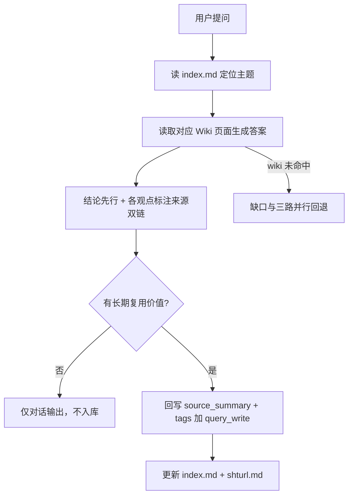
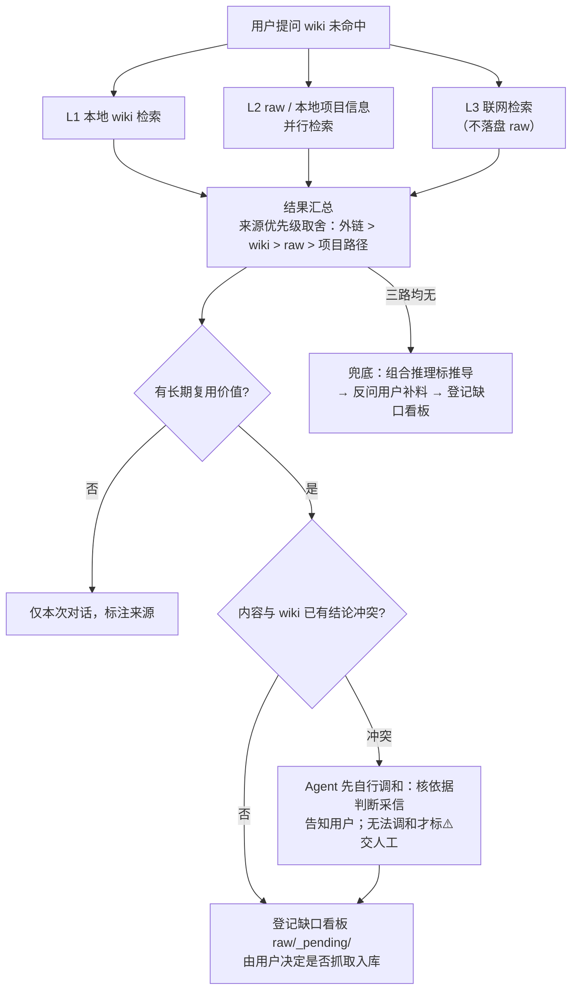

# Query 工作流

## 流程总览

## 核心结论
- **Query**（问答回写）＝基于已编译 Wiki 知识库回答问题，高质量答案再反哺知识库，形成「越用越完整」的闭环。
- 回答要求**结论先行**，每个观点标注 `[[来源页面]]`；库中无内容如实告知、禁止编造，推测内容标【推导】并绑定来源。
- 只有**具备长期复用价值**的答案才回写为 `source_summary` 页面，`tags` 追加 `query_write` 标签，便于月度治理优先复核质量。

## 要点拆解
1. **定位主题**：优先读取 `index.md`，通过 description 快速定位相关主题页面。
2. **读取内容**：综合读取对应 Wiki 页面生成答案；**非必要不读取 raw 原始素材**，保障查询效率。
3. **生成答案**：结论先行 + 来源标注；不同页面观点冲突时 Agent 先自行调和（核对依据、附【当前采信结论】并告知用户），无法调和才并列双方交人工。
4. **延伸推荐**：末尾输出 2-3 个高度相关的延伸主题及 Wiki 链接。
5. **回写判断与执行**：需回写时新建页面，type 统一为 `source_summary`，同步更新 index.md 与 shturl.md。

## 相关页面
- [[ingest工作流]] 的产物是 Query 的输入
- [[lint工作流]]：query_write 页面的质量由月度治理优先复核
- [[元数据规范]]：回写页面同样必须携带完整 Frontmatter

## 缺口与回退（三路并行）

wiki 未命中时，L1 本地 wiki、L2 raw/本地项目信息、L3 联网**三路并行检索**，结果汇总后按来源优先级取舍：**互联网外链 > wiki 双链 > raw 双链 > 项目路径**（wiki 非实时更新，联网权威信息优先采信）。

要点：

- **L1/L2/L3 并行**：三路同时检索，不再逐层下探、命中即停；wiki 信息充足也可联网核验时效性。
- **L3 不落盘**：联网结果仅本次对话参考并标注【来源：互联网搜索】，禁止存入 `raw/articles/`、禁止直接写入 wiki、禁止粘贴摘要。
- **价值判定**：有长期复用价值 → 登记缺口看板 `raw/_pending/`，由用户决定是否另行抓取落盘入库；无价值 → 仅本次对话，不入库。
- **冲突**：汇总内容与 wiki 已有结论语义冲突 → 参考来源优先级综合裁决，Agent 先自行调和：核对依据、附【当前采信结论】并告知用户；无法调和才标 `⚠️观点冲突` 留双方原文交人工裁决，不自动覆盖（与 [[lint工作流]] 的冲突处置原则一致）。
- **兜底**：组合推理（标【推导】）→ 反问用户补料 → 登记缺口看板 `raw/_pending/`，素材到位后触发 Ingest。

## 参考来源
- [[llm-wiki知识库方案]]