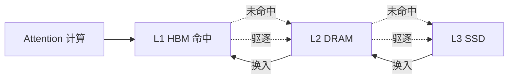

# 三级存储金字塔

## 核心结论

分级存储的载体是三级介质：**带宽逐级衰减、容量逐级放大**。热数据留在最快介质，冷数据沉到最慢介质，于是「有效容量」突破单卡 HBM 物理上限，代价是冷数据的访问延迟。

## 层级参数

| 层级 | 介质 | 带宽 | 容量 | 存储内容 |
|------|------|------|------|----------|
| L1 热层 | GPU HBM | ~3 TB/s | 数十 GB | 最近或最常被注意的 token |
| L2 温层 | CPU DRAM | ~100 GB/s | 数百 GB | 较久未访问、可能被回看的 token |
| L3 冷层 | SSD/网络 | ~数 GB/s | TB 级 | 长期未被访问的 token |

带宽跨度约三个数量级，容量跨度同样约三个数量级——这正是「以带宽换容量」得以成立的物理基础。

## 数据流向

- **向下**：驱逐（eviction），HBM 满了把冷 KV 下沉，见 [[驱逐策略]]。
- **向上**：换入（swap-in），被访问时逐级回迁，见 [[换入换出与数据迁移]]。
- **提前向上**：预取（prefetch），预测命中后提前迁移，见 [[预取机制]]。

## 容量配比实践

- HBM 与 DRAM 容量比约 1:4 至 1:8（热层小、温层大）。
- SSD 作为兜底层，容量不设上限。
- 依据并发数与平均序列长度估算，而非固定比例。

## 与相邻技术的关系

| 技术 | 解决什么 | 是否扩展总容量 |
|------|----------|----------------|
| 前缀缓存 | 跨请求复用相同前缀 KV，降低 prefill 开销 | 否 |
| PagedAttention | 分页管理消除显存碎片，提升利用率 | 否 |
| **分级存储** | 从时间维度分层管理 KV | **是** |

详见 [[前缀缓存与PagedAttention]]。

## 相关页面

- [[KV Cache分级存储]]：本页的上层机制
- [[显存墙]]：三级金字塔要突破的容量与成本约束
- [[驱逐策略]]、[[换入换出与数据迁移]]、[[预取机制]]：三项搬运机制
- [[压缩机制与体积缩减]]：正交的减容手段

## 参考来源

- [[raw/papers/KV Cache分级存储.md]]