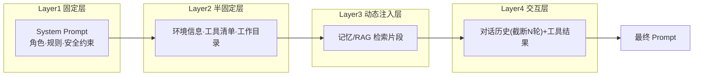

# 上下文分层组织

## 核心结论

上下文不是"塞进去"，而是按生命周期稳定性**分层装配**：稳定性越高越置于固定位置，动态内容后置。编排器按 system → environment+tools → memories → conversation 顺序组装，记忆注入置于历史之前，让模型"先知道背景再读对话"。

## 四层结构

| 层 | 内容 | 生命周期 | 组装顺序 |
|---|---|---|---|
| Layer1 固定层 | 角色、核心规则、安全约束 | 会话内不变 | 1 |
| Layer2 半固定层 | 环境、工具清单、工作目录 | 会话内稳定 | 2 |
| Layer3 动态注入层 | 记忆/RAG 检索片段 | 按查询变化 | 3 |
| Layer4 交互层 | 对话历史+工具结果 | 持续增长 | 4 |

## 工程注意点

- **截断策略**：按最近 N 轮做"剪布"式截断，而非整段丢弃更早信息。
- **背景前置**：记忆块放历史之前，降低模型对远端背景的注意力开销。
- **实现参考**：LangChain Memory 组件、LlamaIndex 的句子窗口检索对应此分层语义。

## 相关页面

- [[AI-Agent上下文管理总览]]：四层是闭环中的第②环
- [[上下文窗口与Token预算]]：分层后仍需预算约束
- [[结构化上下文]]：Layer 内容的结构化封装

## 参考来源

- [[raw/papers/AI-Agent上下文管理综合研究.md]]