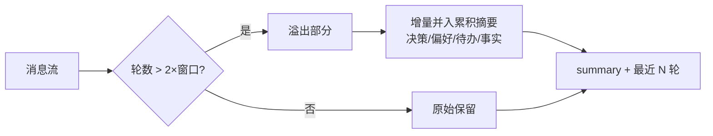

# 上下文压缩与摘要策略

## 核心结论

超出窗口**不能简单丢消息**，必须走"保留关键信息的有损压缩"。经典方案是**滑动窗口 + 渐进式摘要**：最近 N 轮完整保留，更早部分增量并入累积摘要（每次只摘要新增片段，避免全量重算）。这对应 MemGPT 的"上下文即物理内存"视角——窗口是寄存器，溢出就换出到外部存储，需要时换入。

## 滑动窗口 + 渐进式摘要

摘要固定四要素结构：**关键决策与结论、用户偏好与约束、待处理任务、重要数据/事实**。

## 关键信息保留金字塔

| 优先级 | 信息类型 | 保留策略 |
|---|---|---|
| P0 | 安全约束、任务目标 | 始终保留，不可压缩 |
| P1 | 用户偏好、关键决策 | 摘要中显式标注 |
| P2 | 工具结果关键数据 | 结构化提取后保留 |
| P3 | 中间推理过程 | 可大幅压缩 |
| P4 | 已完成的子任务细节 | 仅保留结论 |

## Compaction 调优

Anthropic 将服务端 compact（将整个会话提炼为摘要后重开窗口）视为长会话首要手段。调优方法：**先最大化召回**（压缩提示覆盖每条相关信息），**再迭代提升精度**（剔除冗余）——避免激进压缩导致"摘要漂移"丢关键事实。

## 相关页面

- [[上下文窗口与Token预算]]：压缩是预算不足时的兜底手段
- [[上下文分层组织]]：Layer4 交互层的增长管理
- [[上下文爆炸治理方案对比]]：24 种方案里压缩/出窗一组（被动摘要、递归摘要、LLMLingua 等）

## 参考来源

- [[raw/papers/AI-Agent上下文管理综合研究.md]]