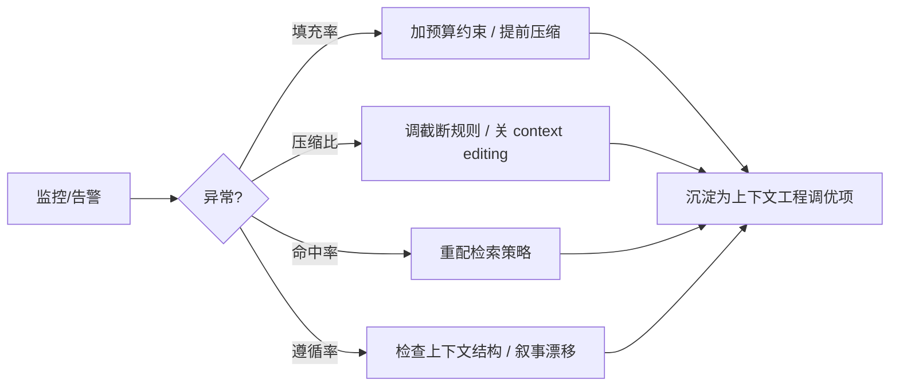

# 上下文监控指标

## 核心结论

上下文工程不可只靠直觉调参，必须有**可度量的闭环**：围绕"窗口用了多少、被什么占了、换来多少记忆、遵循度多高"建立指标，达到阈值即告警。配合上下文可导出（看到每一触发点的完整上下文）就能定位压缩位置与异常来源。

## 四大指标

| 指标 | 定义 | 告警阈值 | 含义 |
|---|---|---|---|
| 填充率 | 已用 token / 窗口上限 | > 80% | 超窗风险高，压缩与截断将被动触发 |
| 工具结果压缩比 | 原始结果 vs 保留 token | < 10% 且关键数据丢失 | 压缩过度、信息流失 |
| 记忆命中率 | 检索片段被有效利用比例 | < 30% | 记忆/检索策略失效 |
| 指令遵循率 | 单条指令准确执行比例 | < 80% | 上下文质量恶化或叙事干扰 |

## 调试报告：上下文可导出

任一触发点（任务开始/每 N 轮/超压告警）导出**完整上下文快照**，覆盖：

- 当前角色设定（是否缺失或被覆盖）
- 窗口内 token 构成（系统/历史/工具结果/Memory 各项占比）
- 压缩记录（何时何地压缩、保留了什么）
- 关键指令"当前值 vs 首次注入值"（识别叙事漂移）

## 反哺链路

## 相关页面

- [[AI-Agent上下文管理总览]]：监控闭环是七环最后一环
- [[上下文窗口与Token预算]]：填充率指标的对象
- [[上下文压缩与摘要策略]]：压缩比的度量对象

## 参考来源

- [[raw/papers/AI-Agent上下文管理综合研究.md]]