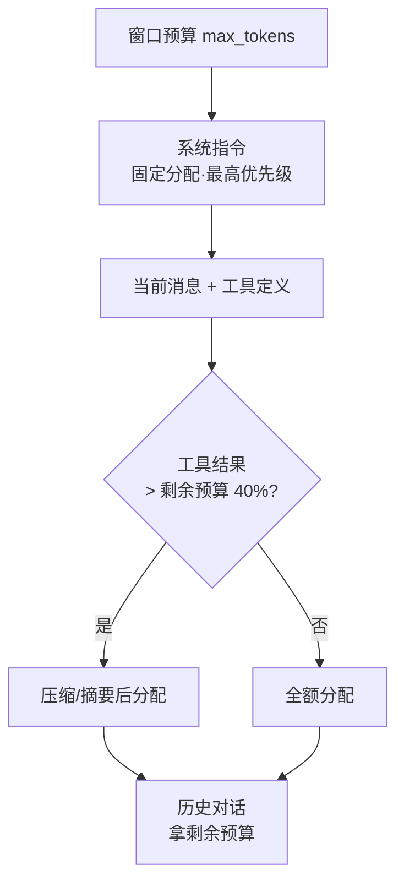

# 上下文窗口与Token预算

## 核心结论

每个模型都有硬性上下文窗口上限，窗口内各项竞争度：`总预算 = 系统指令 + 对话历史 + 工具结果 + 生成预留`。管理要点是**把窗口当预算分配，而不是当天花板撞**——按优先级次序逐级满足，工具结果超标先压缩，历史拿剩余。

## Token 消耗画像

| 成分 | 典型量级 |
|---|---|
| 用户消息 | ~200 tokens |
| System Prompt | ~2,000–8,000 tokens |
| 工具定义（10 个） | ~3,000 tokens |
| 单次工具结果 | ~500–5,000 tokens |
| 历史对话（10 轮） | ~5,000–15,000 tokens |
| **单回合合计（保守）** | **~15,000–30,000 tokens** |

经验估算：英文约 4 chars/token、中文约 1.5 chars/token；生产环境用 tiktoken 等精确分词器。

## 分配优先级

次序依据：**系统指令与最新消息处于上下文首尾，恰是模型利用效率最高的区域**（Lost in the Middle 的 U 形曲线）；工具结果若超剩余预算四成先压缩再注入；历史只拿节余、不足则截断，损失靠摘要与记忆弥补。

## 相关页面

- [[AI-Agent上下文管理总览]]：七环闭环中的预算入口
- [[上下文压缩与摘要策略]]：预算不足时的有损兜底
- [[上下文监控指标]]：填充率告警阈值（>80%）

## 参考来源

- [[raw/papers/AI-Agent上下文管理综合研究.md]]