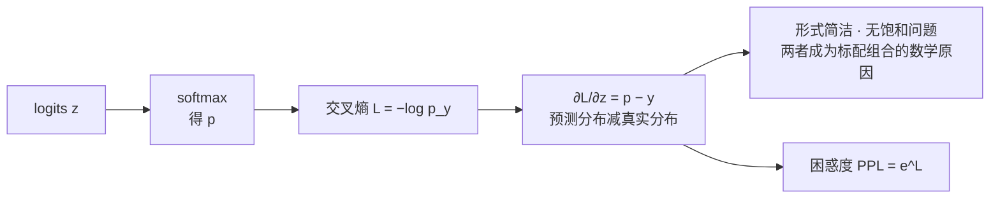

# 交叉熵与梯度简化

## 复合后的梯度

## 核心结论

预训练最小化交叉熵：

$$
\mathcal{L} = -\log\,\text{softmax}(z)_{y_{\text{true}}}
$$

softmax 单独求导较繁琐，但**与交叉熵复合后梯度简化为**：

$$
\frac{\partial \mathcal{L}}{\partial z} = p - y
$$

即**「预测分布减真实分布」**——形式简洁且无饱和问题，这是两者成为标配组合的数学原因。

## 与推理侧的对偶关系

| 阶段 | softmax 的角色 | 关心什么 |
|---|---|---|
| 训练 | 与交叉熵复合求梯度 | $p - y$ 是否稳定、无饱和 |
| 推理 | 输出层产生概率供采样 | 分布形状是否合适，见 [[温度参数与生成采样]] |

值得注意的是，注意力层也存在一个饱和问题——维度大时把 softmax 推入饱和区，解法是缩放，见 [[注意力缩放与因果掩码]]。**训练侧的「无饱和」来自损失复合，推理侧的「防饱和」来自缩放**，两者都指向 softmax 对分布尖锐度的敏感性。

常用指标**困惑度**即交叉熵的指数：

$$
\text{PPL} = e^{\mathcal{L}}
$$

## 相关页面

- [[Softmax归一化原理]]：被复合的那个函数本体。
- [[温度参数与生成采样]]：同一份输出在推理侧的用法。
- [[注意力缩放与因果掩码]]：另一处饱和问题与对策。
- [[Softmax技术全景总览]]：「怎么训」这一段的落点。

## 参考来源

- [[raw/papers/Softmax.md]]
