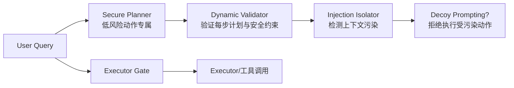

# 任务对齐验证

## 核心结论

- 若不改变架构，就**在执行层实时验证 Agent 的每一步动作与用户任务是否对齐**；凡是计划外/冲突的动作一律拒绝。
- 三套代表方案：Task Shield（ACL 2025）、DRIFT（NeurIPS 2025）、MELON（ICML 2025），各自达成研究级最优数字（见下）。
- 组合印象：任务对齐本质是对**模型上下文可能被污染**的兜底验证，与架构隔离思路互补，而非替代。

## 方案总览

| 方案 | 核心机制 | 关键效果 | 文献 |
|---|---|---|---|
| Task Shield | 任务与自身指令匹配，丢弃冲突执行路径 | ASR 2.07%，效用 69.79%（GPT-4o）| ACL 2025[[2]](#ref-2) |
| DRIFT | 安全规划器+动态验证器+注入隔离器，验证每一步 | ASR 30.7%→1.3%（GPT-4o-mini）| NeurIPS 2025[[3]](#ref-3) |
| MELON | 恶意数据改写 + 任务对齐检测 | MELON-Aug ASR 0.32%（解读类场景）| ICML 2025[[4]](#ref-4) |

## DRIFT 三层机制

<b>图1 DRIFT 组件协作</b>

- **Secure Planner（安全规划器）**：应对兼具低/高风险步骤的复杂任务，将动作限定于低风险集合。
- **Dynamic Validator（动态验证器）**：逐步验证每个动作满足安全约束；高置信度通过才放行。
- **Injection Isolator（注入隔离器）**：拒绝执行受污染的动作，防止注入指令动手。

## Task Shield 机制

- 引入**“自身指令”**（self-instruction）与用户任务进行匹配比对。
- 系统利用 LLM 对输入做实时匹配：一旦发现任务与自身指令冲突，**丢弃冲突的执行路径**，保护 Agent 直调工具时安全。

## MELON 机制

- **恶意数据改写（Malicious Data Rewriting）**：对工具返回中的恶意行为执行改写，从根本上破坏注入载荷；再配**任务对齐检测**（Task-alignment Detection）验证改写后的数据仍服务于原任务。
- High-risk 子任务无法独立检测时，用**专有人工处理/审查链**兜底。
- MELON-Aug 变体：改写 + 对齐双检测 → 0.32% ASR，是推动任务对齐基线的大幅进步[[4]](#ref-4)。

## 局限

- 三个方案都依赖“能识别冲突”的验证能力，对**隐蔽混淆攻击**（payload 在工具返回中暗藏）可能失效。
- 验证器本身也可能被高级注入攻击劫持；ASR 数字是在受控 benchmark 上得出，真实对抗环境下需保守解读[[2]](#ref-2)[[3]](#ref-3)[[4]](#ref-4)。

## 相关页面

- [[LLM-Agent安全防护总览]]：第③层——规划执行层防御
- [[CaMeL能力沙箱]]：数据提取阶段的架构隔离
- [[工具调用零信任管控]]：执行链路最末端兜底
- [[提示词注入]]：威胁定义

## 参考来源

- [[raw/papers/LLM-Agent安全防护-提示词注入防御与权限最小化综合研究.md]]
- [[raw/articles/deepseek-agent防提示词注入.md]]

---

[2] Y. Jia et al. ["The Task Shield."](https://aclanthology.org/2025.acl-long.1435/) *ACL*, 2025.
[3] T. Li et al. ["DRIFT: A Multi-Component Dynamic Defense Against Prompt Injection."](https://proceedings.neurips.cc/paper_files/paper/2025/file/77f3b26c7907aa27b207df9b9d43f29a-Paper-Conference.pdf) *NeurIPS*, 2025.
[4] C. Zhu et al. ["MELON: Improving Prompt Injection Attacks and Defenses with Malicious Data Rewriting."](https://proceedings.mlr.press/v267/zhu25z.html) *ICML*, 2025.