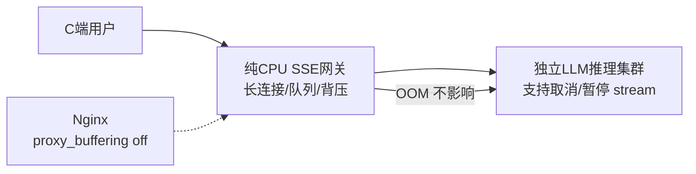

# 入口网关水位熔断

## 核心结论

- **关闭代理层buffer**：nginx `proxy_buffering off` + 响应头`X-Accel-Buffering: no`；Envoy限制per-connection buffer，溢出直接断开而非无限缓存。但注意：适度缓冲能隔离慢客户端保护后端，应权衡buffer大小。
- **全局水位控制做load shedding而非等OOM**：单机连接数上限、单用户并发SSE数限制；进程内存水位监控——超70%熔断新请求、超85%踢掉最慢一批连接。
- **全局限流与隔离**：单连接缓冲上限（256KB～1MB）、全局内存配额、租户限流；cgroup隔离流式代理，OOM不影响核心服务。
- **规模化架构隔离**：单进程托管SSE+LLM极易OOM，应拆分为「纯CPU的SSE网关（管长连接/队列/背压）」与「独立LLM推理集群（支持取消/暂停、OpenAI兼容stream）」，经HTTP/gRPC stream通信。

## 架构隔离示意图

## 相关页面
- [[SSE背压与内存治理总览]]：五层框架全局视角
- [[SSE有界队列]]：第二层——单连接缓冲上限的对应
- [[慢消费者处置]]：第三层——85%水位踢最慢连接的对应
- [[背压透传]]：第一层——同步转发透传背压

## 参考来源
- [[raw/papers/面向SSE流式转发的背压与内存治理研究.md]]