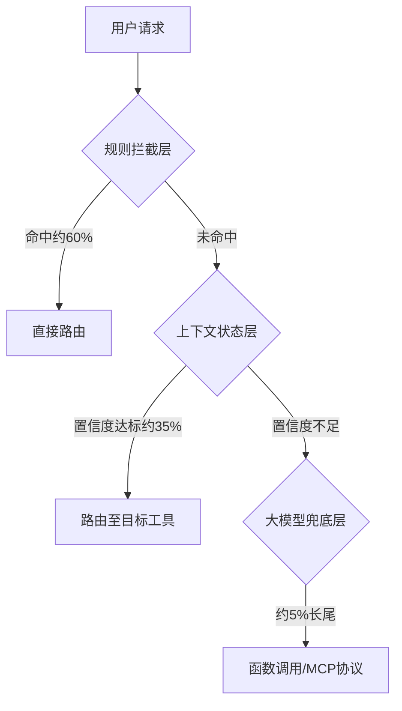

# 分层漏斗路由

## 架构图

## 核心结论
- 分层漏斗的核心思想是**按请求复杂度分配算力**。
- 简单请求上层极速闭环，常规请求轻量模型处理，只有复杂长尾才动用昂贵大模型。
- 三层逐级过滤，每层只处理上一层无法确认的请求。

## 要点拆解

### 设计原则
- **规则层不无限堆砌**：只维护高频、稳定不变的意图，规则过多会导致冲突与维护成本爆炸。
- **上下文层不做重型推理**：使用轻量小模型完成语义分类与槽位填充，不消耗大模型算力。
- **大模型层绝不扛主流量**：仅作为最后兜底防线，处理前两层置信度不足的长尾请求。

### 层间协同与冲突解决
1. **信息传递**：规则层未命中时，将原始请求与规则匹配中间结果传递至上下文层，辅助轻量模型判断。
2. **冲突解决**：若规则层与上下文层同时命中但意图不一致，以规则层结果为准（确定性优先），同时将冲突案例记录至审计日志供后续分析。
3. **降级策略**：上下文层服务不可用时，规则层命中直接路由，未命中请求全部降级至大模型层，保证服务可用性。

### 效果对比
| 方案 | 平均延迟 | 日均 GPU 成本 | 准确率 |
|------|----------|--------------|--------|
| 全量大模型 | 2000ms | 100% | 约 92% |
| 分层漏斗 | 50ms | 15-25% | 约 95% |

## 相关页面
- [[Agent意图识别]]：主题页
- [[规则拦截层]]：第一层技术细节
- [[上下文状态层]]：第二层技术细节
- [[大模型兜底层]]：第三层技术细节
- [[置信度阈值]]：层间流转机制
- [[全量大模型vs分层漏斗]]：方案对比

## 参考来源
- [[raw/papers/工业级Agent意图识别分层漏斗.md]]
