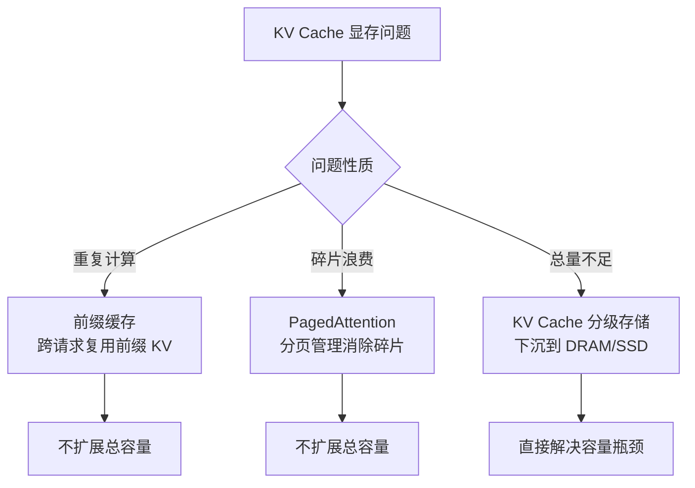

# 前缀缓存与PagedAttention

## 核心结论

两个最常与分级存储混淆的相邻技术，**都解决的是「利用率」问题，不是「总容量」问题**。前缀缓存跨请求复用 KV 省的是重复计算，PagedAttention 分页管理省的是碎片——显存总量该是多少还是多少。

## 前缀缓存

- **复用范围**：跨请求。系统指令、回复格式、固定模板等 prompt 前缀的 KV 被缓存，下次前缀相同即跳过重复计算。
- **解决什么**：prefill 阶段的重复计算，主要降 [[TTFT首字延迟优化]]。
- **不解决**：单请求内 KV 的容量问题；每轮变化的部分（如 RAG Top5）也无法跨请求缓存。

## PagedAttention

- **机制**：把 KV 按页管理，页大小固定（默认 16 Token）、按需分配，取代连续内存分配带来的碎片。
- **三段映射**：**逻辑块**（序列视角连续）→ **块表/页表**（记录逻辑块到物理块的编号）→ **物理块**（显存中非连续，按需分配用完即还）。物理与逻辑解耦，正是碎片被消除的根源，详见 [[PagedAttention分页内存]]。
- **解决什么**：显存碎片。朴素连续分配按最大长度预分配，利用率仅 20%–40%、浪费 60%–80%；分页后浪费降至 **4% 以下**、利用率提升至 **96% 以上**。
- **写时Copy-on-Write**：同 Prompt 多采样共享前缀物理块，只在写入时分裂，beam search 场景显存节省可达 **55%**。
- **与连续批处理互为使能**：KV 块可独立调度、无需连续对齐，请求得以动态加入退出，GPU 利用率大幅提升。
- **不解决**：总容量不变；且当 KV 总量确实超过 HBM 容量时，仍需靠换出——页级换出正是它在容量不足时的手段。

## 三者对照

| 机制 | 维度 | 复用/作用范围 | 是否扩展总容量 |
|------|------|----------------|----------------|
| KV Cache | 单请求内 | 省历史 K/V 重算 | 否 |
| 前缀缓存 | 跨请求 | 省 prefill 重复计算 | 否 |
| PagedAttention | 单请求内 | 消除碎片、提升利用率 | 否 |
| 分级存储 | 跨层 | 冷 KV 下沉换容量 | **是** |

## 相关页面

- [[KV Cache]]：三者共同作用的对象
- [[KV Cache分级存储]]：唯一扩展总容量的方案
- [[PagedAttention分页内存]]：分页机制本体与块表三段映射
- [[KV Cache优化技术栈总览]]：系统管理层在五级栈中的位置
- [[vLLM]]：PagedAttention 的提出方
- [[TTFT首字延迟优化]]：前缀缓存的收益落点

## 参考来源

- [[raw/papers/KV Cache.md]]
- [[raw/papers/KV Cache分级存储.md]]