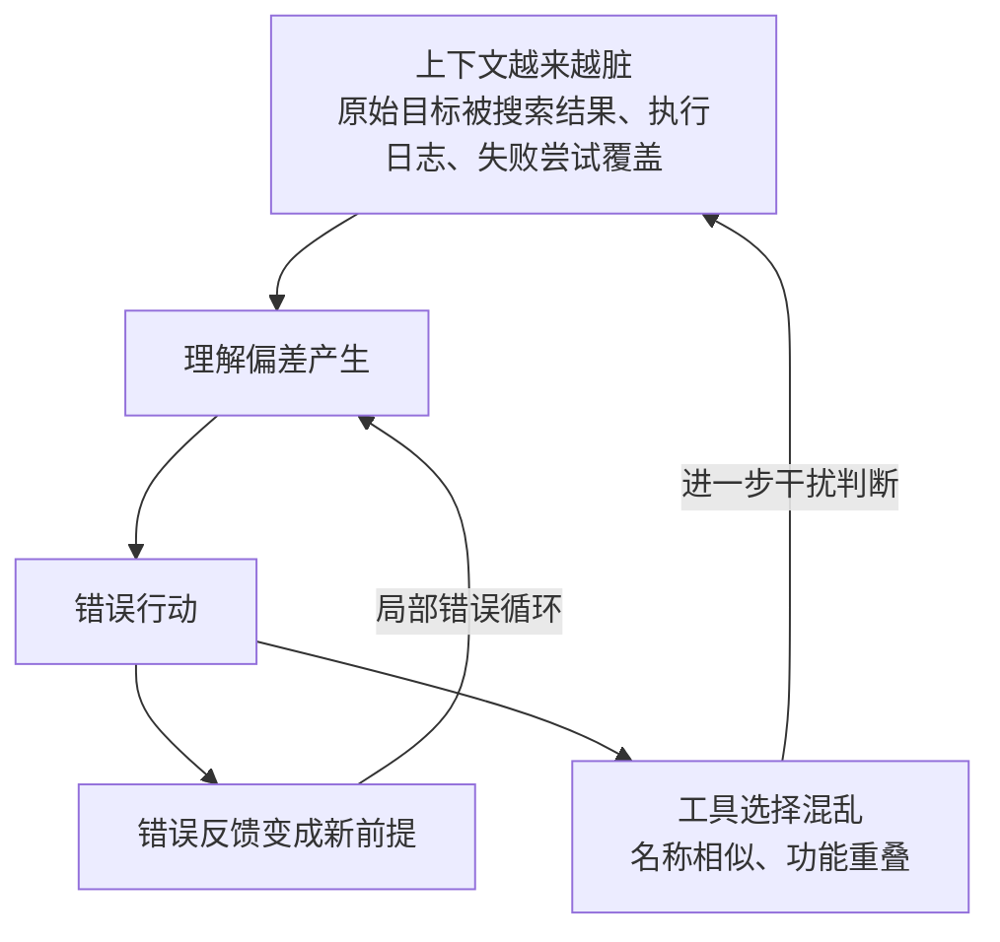

# 单体Loop结构性瓶颈

## 失控放大机制图

## 核心结论

- 一个 Agent 承包全部工作，会在复杂任务上快速撞上天花板，问题集中在**五点**。
- 五个瓶颈**不是孤立的**，它们彼此喂养形成放大回路：噪（上下文变脏）→ 偏（错误变前提）→ 选（工具难选择）。
- 除了崩溃，失控还有更隐蔽的形式——**古德哈特定律**：指标做高了，业务结果却可能变差。
- **能运行不等于能上线**：生产要求的暂停、审批、断点恢复、审计追溯，Loop 架构天然不支持。

## 要点拆解

### 五大结构性瓶颈

| 编号 | 瓶颈 | 表现 | Graph 对策 |
|------|------|------|-----------|
| 1 | **上下文稀释** | 原始目标被网页、日志、失败记录淹没，越跑越偏离初衷 | 按节点隔离上下文 |
| 2 | **错误级联** | 理解偏差→错误行动→错误反馈变新前提，形成局部死循环 | 独立检查与回退 |
| 3 | **工具过载** | 工具越多越相似，"选工具"本身变成复杂任务 | 按节点暴露必要工具 |
| 4 | **控制粒度过粗** | 难以插入审批、预算控制、差异化策略，逻辑封在黑盒里 | 边（E）上插入控制点 |
| 5 | **故障定位困难** | 跑崩后只能从头重跑，无法精准回退 | 检查点 + 状态回放 |

### 失控三机制与对策

- **噪｜上下文越来越脏**：原始目标逐渐被搜索结果、执行日志和失败尝试覆盖 → **Graph：按节点隔离上下文**
- **偏｜错误变成新前提**：理解偏差 → 错误行动 → 错误反馈 → 局部错误循环 → **Graph：独立检查与回退**
- **选｜工具不是越多越好**：名称相似、功能重叠时，选择工具本身就成为复杂任务 → **Graph：按节点暴露必要工具**

### 生产环境四能力缺口

生产系统不仅要完成任务，还要**暂停、恢复、定位与审计**：

- **停｜暂停**：敏感动作执行前进入等待状态
- **人｜审批**：关键节点由人工确认后继续
- **回｜恢复**：从检查点继续，而不是全部重跑
- **审｜审计**：能够定位节点、状态和执行记录

> 这四项恰是黑盒 Loop 的盲区，也是 Demo 惊艳的 Agent 一上线就失控的核心原因。

### 目标偏移：古德哈特定律

**当一个指标变成目标时，它可能就不再是一个好指标。** 典型链条：

- 模型会本能地奔着指标去，而不是奔着业务真实目标去
- 单体 Loop 缺乏独立校验时，这种偏移无人拦截——需要独立验证节点对照真实业务结果

## 相关页面

- [[Loop与Graph控制流演进]]：从 L4 升级到 L5 的动因
- [[Graph图编排架构]]：五瓶颈的一一对应的解法载体
- [[独立验证机制]]：拦截错误级联与目标偏移的关键手段
- [[上下文污染]]：上下文稀释在多 Agent 场景的更一般形态
- [[Agent循环终止与护栏]]：Loop 侧的终止与保护机制
- [[输出验证与人工审批]]：停/人两项能力的落地形式

## 参考来源

- [[raw/articles/Loop之后为什么是Graph.md]]
