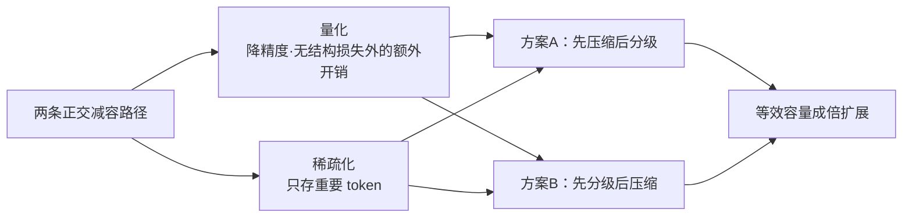

# 压缩机制与体积缩减

## 核心结论

压缩是分级存储之外的**第二条减容路径**：不改介质层级，而是直接缩小每个 KV 本身的大小。它与分级**正交**——两种顺序（先压缩后分级、先分级后压缩）都成立，可叠加使用。

## 两条路径

- **量化**：FP16 降至 INT8/INT4，体积减半或缩减至四分之一。改动最小、工程最易落地，是主流选择。
- **稀疏化**：仅存储重要 token 的 KV，与 [[驱逐策略]] 的注意力分数判据同源——同样认为并非所有 token 等价。

## 与分级的关系

| 维度 | 分级存储 | 压缩 |
|------|----------|------|
| 作用对象 | KV 放在哪 | KV 有多大 |
| 额外代价 | 换入换出延迟 | 精度损失 |
| 顺序 | 二者正交，可任意先后或叠加 |

## 相关页面

- [[KV Cache分级存储]]：压缩的正交对手
- [[显存墙]]：压缩与分级共同缓解的瓶颈
- [[驱逐策略]]：稀疏化共享的「重要性」判据
- [[PQ乘积量化]]：向量检索侧的量化，思路同源但对象不同

## 参考来源

- [[raw/papers/KV Cache分级存储.md]]