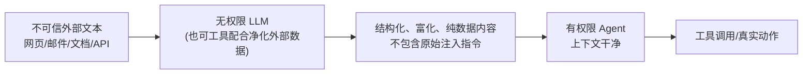

# 双LLM模式

## 核心结论

- 思路：用**两个模型代理物理隔离攻击面**——一个无权限的通用LLM专门处理不可信文本，一个有权限的Agent只接触可信、富化后的内容[[1]](#ref-1)。
- 与"沙箱隔离 Agent 行为"不同，双 LLM 是**隔离"谁的上下文里能出现攻击者指令"**，从源头切断[[1]](#ref-1)。
- 关键洞见：注入验证模型的输入是普通用户消息，上下文里没有任何 sensitive instruction，**攻击者设计的注入指令被当成普通文本处理**，验证模型从中提取任务信息，恶意指令不会被执行[[1]](#ref-1)。

## 总体架构

<b>图1 双 LLM 信息流</b>

## 两种隔离形态

| 形态 | 做法 | 优势 |
|---|---|---|
| 进程级隔离 | 两个独立 LLM 进程，开关/服务级隔离，上下文分离 | 可分别 bound 上下文，保密推理 |
| 架构隔离 | 外层 LLM 负责交互，内层 LLM 手持工具，调用遵循出口（非入口）指令 | 第三条注入路径被从根上关闭 |

覆盖了两条主注入路径：让 LLM 自我暴露、通过受害工具返回数据传播。

## 局限

- 成本 ×2：两个模型各自推理，Token/延迟翻倍；需权衡高安全场景才用。
- 有权限 Agent 上下文虽已净化，仍非绝对安全；需配合[[LLM权限最小化]]与[[工具调用零信任管控]]做行为兜底。
- 无法解决"无权限 LLM 本身被诱导输出恶意内容"的残余风险，需输出侧校验配合[[输出验证与人工审批]]。

## 相关页面

- [[LLM-Agent安全防护总览]]：作为第②层架构隔离的提法
- [[CaMeL能力沙箱]]：双 LLM 思路在 Agent 世界的空间推论
- [[提示词注入]]：本方案要解决的威胁
- [[任务对齐验证]]：在上下文可能被污染的前提下做行为兜底

## 参考来源

- [[raw/papers/LLM-Agent安全防护-提示词注入防御与权限最小化综合研究.md]]
- [[raw/articles/deepseek-agent防提示词注入.md]]

---

[1] DeepSeek Agent 防提示词注入素材（双 LLM / 无特权通用LLM 讨论），见 [[raw/articles/deepseek-agent防提示词注入.md]]