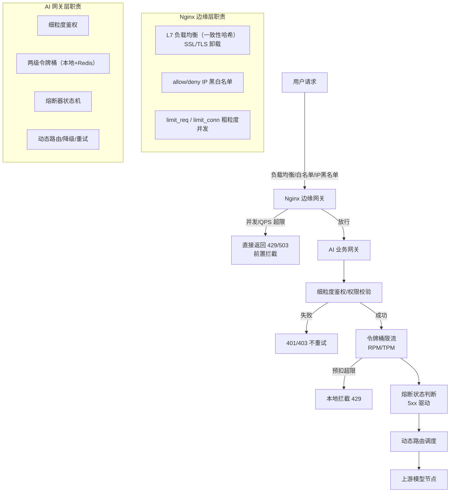

# 双层网关架构

## 架构图

## 核心结论
- **双层 = 边缘流量治理（Nginx）与核心业务调度（AI 业务网关）解耦**：Nginx 专注高性能连接管理、IP 黑白名单、SSL 卸载与 `limit_req/limit_conn` 粗粒度并发控制；AI 网关专注模型维度的配额、熔断、路由、降级等 LLM 专属逻辑。
- 核心优势是**职责分离**：无业务语义的流量治理留在边缘，业务语义调度进核心，各自演进、各自伸缩。
- 请求全链路：Nginx 前置拦截 → AI 网关鉴权 → 令牌桶限流 → 熔断判断 → 动态路由 → 上游响应分支处理（200 / 401/403 / 5xx / 429）。

## 要点拆解

### 为什么需要双层而非单层
单层既扛不住高并发又不理解 LLM 语义；Nginx 是事实标准的边缘反向代理（性能强、模块化限流），在其上强化 LLM 业务逻辑会造成模块爆炸。拆双层让 Nginx 用成熟能力挡边缘，AI 网关用自定义状态机做语义调度。

### 边缘层三项职责
1. **L7 负载均衡 + 一致性哈希**：请求分发到多 AI 网关实例，避免单点过载。
2. **安全访问控制**：SSL 卸载释放后端 CPU；allow/deny 黑名单拦截爬虫与 DDoS。
3. **粗粒度并发限流**：`limit_req`/`limit_conn` 在进入 AI 网关前拦掉突发流量（429/503），防止下游被击垮。

### 核心里程
鉴权 → 两级令牌桶（本地快速预拦 + Redis 全局权威）→ 熔断器（5xx 错误率驱动）→ 动态路由调度 → 上游响应分类处理。

### MCP 场景的落地形态
当 AI 业务网关以 MCP 网关形态出现时，内部细化为三层：MCP服务端（解析 JSON-RPC）→ MCP路由模块（编排 RAG/Tool/Memory 等能力）→ LLM调用子模块（内置令牌桶-熔断-路由降级）。业务能力走 MCP 协议路由，仅模型推理下沉到流量调度与上游转发，详见 [[MCP网关]]。

## 相关页面
- [[LLM网关动态路由与流量治理总览]]：本架构的总览定位
- [[熔断器状态机]]：AI 网关层的核心状态机
- [[RPM与TPM联合令牌桶]]：配额限流实现
- [[能力标签驱动降级]]：动态路由的降级策略
- [[MCP网关]]：AI 业务网关的 MCP 落地形态

## 参考来源
- [[raw/papers/面向大模型服务的动态路由与流量治理架构研究.md]]