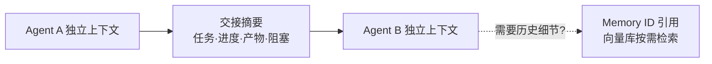

# 多Agent上下文路由

## 核心结论

多 Agent 系统中最贵的"复制"是把 A 的完整上下文复制给 B——**上下文继承导致的 token 指数级膨胀**正是 [[上下文污染]] 的三种严重形式之一。正确路由是：每个 Agent 拥有**独立上下文空间**，跨 Agent 只传**结构化交接摘要**（任务+进度+产物+阻塞），需要历史时走 Memory ID 引用。

## 交接协议

交接摘要固定四字段，保持"小而全"：

| 字段 | 内容 | 目的 |
|---|---|---|
| task | 当前任务目标与约束 | 上下文连续 |
| progress | 已完成步骤与结论 | 避免重做 |
| artifacts | 产物/文件位置 | 按名寻址 |
| blockers | 阻塞点与待确认 | 交接重点 |

## 三条纪律

1. **禁止全量上下文复制**——只传摘要，防止爆炸。
2. **空间隔离**——A 的临时工具结果不进 B 的窗口。
3. **引用替身**——超长历史以"外部引用 + 描述"占位，按需取回（对应 [[上下文爆炸治理方案对比]] 中"可逆性"底座）。

## 相关页面

- [[多Agent上下文管理总览]]：三大核心问题（路由/一致性/异常）全景
- [[上下文污染]]：全量复制是污染根源之一
- [[多Agent上下文传递方式对比]]：继承/注入/引用三种方式横向对比

## 参考来源

- [[raw/papers/AI-Agent上下文管理综合研究.md]]