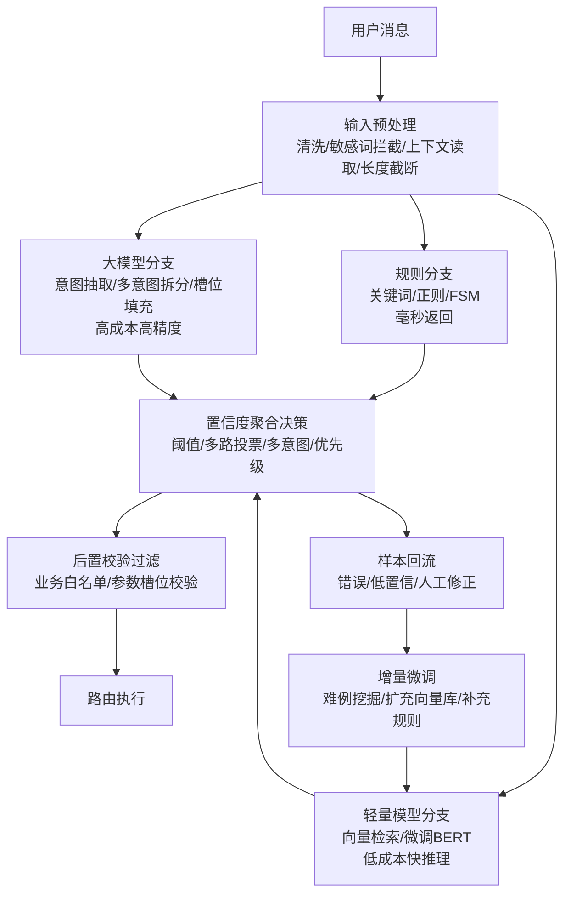

# 工业级意图识别架构

## 流程总览



<p align="center">图 1 工业级意图识别五模块架构</p>

## 核心结论

- **核心原则**：不单一依赖大模型或传统分类模型，采用多分支混合识别
- **五模块**：输入预处理 → 多路并行识别 → 置信度聚合决策 → 后置校验过滤 → 样本回流迭代
- **关键权衡**：延迟、成本、准确率三者平衡

## 要点拆解

### 传统 NLP vs 大模型
- 传统 BERT：固定少量意图，新增需重训，泛化差
- 大模型原生：不用标注，但 token 成本高、P99 延迟不可控、易幻觉

### 最小实现示例
```python
def recognize_intent(user_input, context):
    rule_result = rule_branch.match(user_input)
    model_result = bert_classifier.predict(user_input)
    llm_result = llm_extractor.extract(user_input)

    candidates = [rule_result, model_result, llm_result]
    best = max(candidates, key=lambda c: c.confidence)

    if best.confidence > HIGH_THRESHOLD:
        return route(best.intent, context)
    elif best.confidence > LOW_THRESHOLD:
        return vote(candidates, context)
    else:
        return escalate_to_human(user_input)
```

## 相关页面

- [[多路并行识别]]：三路分支详解
- [[置信度聚合决策]]：阈值与投票机制
- [[后置校验过滤]]：白名单与槽位校验
- [[样本回流迭代]]：难例挖掘与增量微调
- [[串行漏斗vs多路并行]]：选型对比
- [[Function Calling三阶段模型]]：LLM 工具调用三阶段
- [[Agent循环]]：Agent 循环与意图路由

## 参考来源

- [[raw/papers/工业级AI意图识别架构.md]]
